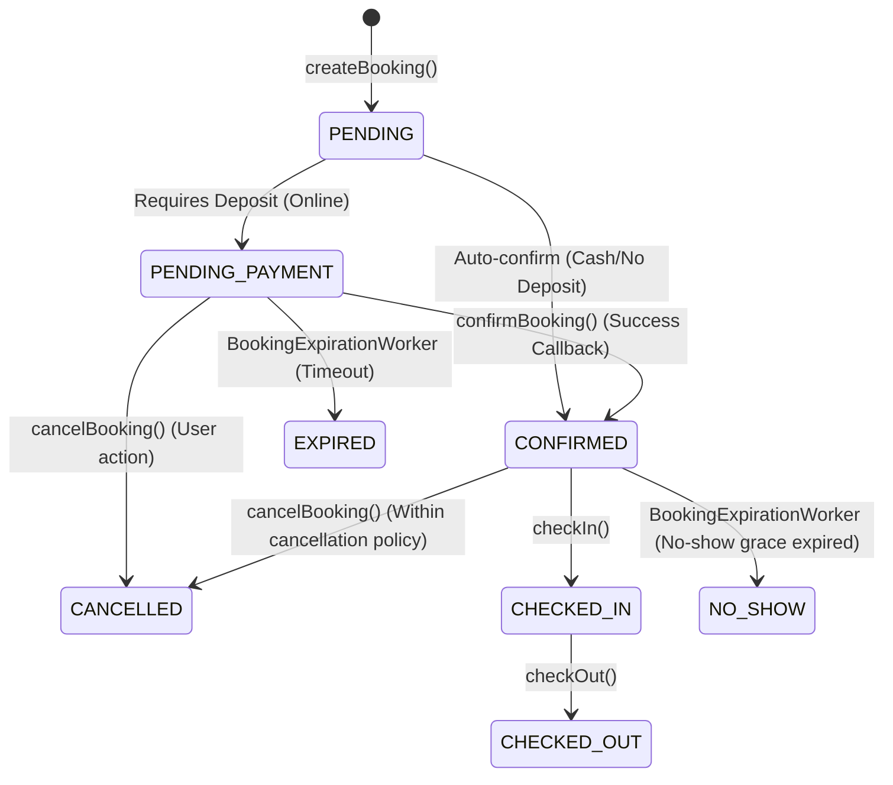

# ADR: Booking Lifecycle Architecture

## 1. Booking Lifecycle States

Hệ thống OmniBooking quản lý trạng thái của Booking thông qua các bước nghiêm ngặt nhằm tránh race condition và đảm bảo tính nhất quán dữ liệu. Các trạng thái bao gồm:

- **PENDING**: Booking vừa được khởi tạo, đang chờ xử lý.
- **PENDING_PAYMENT**: Booking yêu cầu thanh toán đặt cọc trực tuyến (Momo/Visa). Có thời gian hết hạn (`expiresAt`).
- **CONFIRMED**: Booking đã được xác nhận (hoặc thanh toán thành công, hoặc không cần cọc và được tạo bởi tài khoản hợp lệ).
- **CANCELLED**: Khách hàng hoặc hệ thống hủy booking.
- **EXPIRED**: Booking không hoàn tất thanh toán trước khi hết hạn và bị worker tự động quét hủy.
- **CHECKED_IN**: Khách đã nhận phòng thành công.
- **CHECKED_OUT**: Khách đã trả phòng thành công.
- **NO_SHOW**: Khách không đến nhận phòng sau thời gian quy định (No-Show Grace Period).

### State Diagram



---

## 2. State Machine Design

- **BookingStateMachine** là nơi duy nhất giữ thẩm quyền quyết định chuyển đổi trạng thái của Booking.
- **Quy tắc chuyển đổi**: Mọi thay đổi trạng thái phải đi qua phương thức `transition()`. Phương thức này sẽ kiểm tra xem trạng thái mới có hợp lệ từ trạng thái hiện tại hay không và thực hiện kiểm tra nghiệp vụ bổ sung (ví dụ: chỉ cho phép hủy nếu chưa nhận phòng).
- **Chính sách ngăn chặn**: Tuyệt đối cấm sử dụng trực tiếp `booking.setStatus()` và lưu vào cơ sở dữ liệu mà không đi qua `BookingStateMachine`. Việc này giúp ngăn ngừa các lỗi trạng thái logic bất hợp lệ.

---

## 3. Atomic Transition Strategy

Để tránh race condition giữa các yêu cầu đồng thời (ví dụ: Momo gửi webhook xác nhận thanh toán đúng lúc worker đang quét hết hạn), hệ thống áp dụng chiến lược chuyển đổi nguyên tử (atomic transition):

- **`atomicExpireBooking()`**: Sử dụng câu lệnh UPDATE kết hợp kiểm tra trạng thái ngay ở tầng database:
   ```sql
   UPDATE booking SET status = 'EXPIRED', updated_at = :now
   WHERE id = :bookingId
   AND status IN ('PENDING', 'PENDING_PAYMENT')
   AND expires_at < :now
   ```
- **`atomicConfirmBooking()`**: Tương tự:
   ```sql
   UPDATE booking SET status = 'CONFIRMED', expires_at = NULL, updated_at = :now
   WHERE id = :bookingId
   AND status = 'PENDING_PAYMENT'
   ```
- **Sử dụng `rowsUpdated`**: Số hàng bị ảnh hưởng (`rowsUpdated`) trả về từ database là concurrency guard duy nhất. Nếu `rowsUpdated == 0`, điều đó có nghĩa là tiến trình khác đã thực hiện chuyển đổi trạng thái thành công trước đó. Các side-effects (gửi mail, ghi log giao dịch, hoàn tiền, giải phóng inventory) chỉ được chạy nếu và chỉ nếu `rowsUpdated > 0`.

---

## 4. Expiration Strategy

- **Batch-based worker**: `BookingExpirationWorker` chạy theo chu kỳ mỗi phút, sử dụng phân trang (paging) để tải các booking hết hạn theo từng lô (batch size cấu hình được) nhằm tránh quá tải bộ nhớ.
- **ShedLock & Sentry Cron**: Đảm bảo tại một thời điểm chỉ có duy nhất một instance của worker chạy trong môi trường phân tán (Cluster). Sentry Cron được tích hợp để theo dõi sức khỏe và gửi cảnh báo nếu worker không chạy đúng giờ.
- **REQUIRES_NEW transaction isolation**: Quá trình hủy/hết hạn cho từng booking trong lô được bọc trong một transaction riêng biệt (`REQUIRES_NEW`). Nếu một booking gặp lỗi, nó sẽ roll back giao dịch của riêng nó và không làm ảnh hưởng đến các booking khác trong cùng lô.

---

## 5. Inventory Release Strategy

- **Idempotency**: Việc giải phóng inventory được bảo vệ bởi trạng thái nguyên tử. Inventory chỉ được giải phóng khi trạng thái của booking chuyển đổi thành công sang `CANCELLED` hoặc `EXPIRED`.
- **Inventory Ledger**: Toàn bộ thao tác cập nhật số phòng trống (`RoomAvailability`) được ghi lại trong bảng nhật ký `inventory_operations` (chế độ audit-only) dưới dạng `RESERVE` hoặc `RELEASE` nhằm phục vụ việc đối soát và khôi phục khi có sự cố.
- **Trigger**: Việc giải phóng inventory chỉ được gọi ở cuối transaction sau khi state transition của booking thành công.

---

## 6. Idempotency Strategy

Hệ thống bảo vệ chống lặp yêu cầu ở 3 cấp độ:

1. **Request-level**: `IdempotencyAspect` sử dụng Redis để lưu trữ `X-Idempotency-Key` kèm theo SHA-256 hash của request body. Nếu một key được gửi lên với body khác biệt, hệ thống lập tức từ chối với lỗi `IDEMPOTENCY_CONFLICT` thay vì chấp nhận yêu cầu sai lệch.
2. **Event-level**: Tầng xử lý sự kiện bất đồng bộ sử dụng bảng `processed_events` trong PostgreSQL để lưu trữ ID của các message đã được tiêu thụ.
3. **Payment-level**: Khai báo ràng buộc UNIQUE trên cột `provider_transaction_id` của bảng `transactions` để chặn đứng bất kỳ sự cố trùng lặp giao dịch nào từ webhook của bên thứ ba.

---

## 7. Payment Consistency Guarantees

- **Atomic confirmation**: Thực hiện cập nhật trạng thái thông qua câu lệnh SQL nguyên tử `UPDATE WHERE status = 'PENDING_PAYMENT'`.
- **Atomic transaction**: Ghi nhận Transaction và lưu Outbox event trong cùng một transaction JPA.
- **Duplication safety**: Bắt ngoại lệ `DataIntegrityViolationException` khi có xung đột unique key của `provider_transaction_id`. Nếu xảy ra, chỉ cần log và bỏ qua mà không làm hỏng dữ liệu hoặc tạo transaction trùng lặp.
- **Transactional Outbox**: Gửi email xác nhận đặt phòng bất đồng bộ thông qua Outbox Worker để đảm bảo tính nhất quán (nếu gửi mail trực tiếp trong transaction của API, lỗi mạng khi gửi mail có thể làm rollback toàn bộ transaction đặt phòng).

---

## 8. Failure Recovery Model

- **Worker Expiration**: Xử lý lỗi cô lập ở từng booking nhờ `REQUIRES_NEW` transaction và ShedLock.
- **Reconciliation Worker**: `BookingReconciliationWorker` chạy định kỳ hàng ngày dưới dạng chỉ báo cáo (report-only). Nó so quét database để tìm 3 loại bất thường (anomaly categories):
   1. **Stuck Bookings**: Booking ở trạng thái `PENDING_PAYMENT` nhưng đã quá thời hạn hết hạn mà worker chưa quét tới (ví dụ do worker bị tắt hoặc crash).
   2. **Inventory Leaks**: Số phòng trống không khớp với tổng số lượng phòng trừ đi các booking đang hoạt động.
   3. **Orphaned Payments**: Có transaction ghi nhận thành công nhưng booking vẫn ở trạng thái `PENDING_PAYMENT` hoặc đã bị hủy/hết hạn.
- **Metrics**: Các metrics Prometheus tương ứng với từng loại bất thường được tăng lên khi worker phát hiện lỗi, giúp kích hoạt các cảnh báo tự động gửi về đội vận hành.

---

## 9. Database Constraints

Đảm bảo tính toàn vẹn dữ liệu ở mức vật lý:

- **`CHECK (status != 'PENDING_PAYMENT' OR expires_at IS NOT NULL)`**: Đảm bảo booking chờ thanh toán bắt buộc phải có hạn định hết giờ.
- **`CHECK (status != 'CONFIRMED' OR expires_at IS NULL)`**: Booking đã xác nhận phải xóa hạn định hết giờ.
- **`CHECK (status != 'EXPIRED' OR expires_at IS NOT NULL)`**: Giữ lại mốc thời gian hết hạn làm bằng chứng lịch sử đối soát.
- **`UNIQUE (provider_transaction_id)`**: Ràng buộc duy nhất trên bảng transactions để tránh tạo giao dịch kép.

---

## 10. Observability

- **Prometheus Counters**:
   - `booking_lifecycle_transitions_total` (labels: from, to, success)
   - `inventory_operations_total` (labels: type, status)
   - `payment_callbacks_total` (labels: method, status)
   - `reconciliation_anomalies_total` (labels: category)
- **Prometheus Alert Rules**: Các luật cảnh báo quan trọng bao gồm:
   - Cảnh báo tỷ lệ lỗi hết hạn booking cao.
   - Cảnh báo có giao dịch mồ côi (Orphaned Payments).
   - Cảnh báo rò rỉ inventory (Inventory Leaks).
   - Cảnh báo Expiration Worker hoặc Reconciliation Worker ngừng chạy quá thời gian cấu hình.
- **Grafana Dashboard**: Dashboard hiển thị sức khỏe của luồng booking, bao gồm biểu đồ trạng thái đặt phòng, tỷ lệ chuyển đổi Momo/Visa, tần suất chạy worker và phân phối các loại bất thường đối soát.

---

## 11. Inventory Ledger Scalability & Partitioning Strategy

### 11.1 Growth Analysis

Dự báo lượng dữ liệu sinh ra bởi bảng nhật ký `inventory_operations` dựa trên số lượng đặt phòng hàng ngày và số đêm nghỉ trung bình (được tính bằng `Bookings/day * Avg nights * 2` vì mỗi ngày trong khoảng nghỉ của một phòng cần 1 bản ghi thay đổi số lượng, nhân với 2 cho thao tác RESERVE và RELEASE):

| Quy mô (Scale) | Bookings/ngày | Số đêm trung bình | Số Ops/ngày | Số dòng/năm |
| :------------- | :------------ | :---------------- | :---------- | :---------- |
| **Small**      | 1K            | 3 đêm             | 6K ops      | ~2.2M dòng  |
| **Medium**     | 10K           | 3 đêm             | 60K ops     | ~22M dòng   |
| **Large**      | 50K           | 3 đêm             | 300K ops    | ~110M dòng  |

### 11.2 Future Partition Strategy

Khi đạt quy mô lớn, bảng nhật ký `inventory_operations` cần được phân vùng (partitioning) để duy trì hiệu năng:

- **Phương án A: Phân vùng theo tháng dựa trên cột `created_at`**
   - **Ưu điểm**: Phù hợp với đặc tính dữ liệu dạng chuỗi thời gian (time-series). Dễ dàng xóa hoặc lưu trữ dữ liệu cũ (archival) bằng cách DROP hoặc nén phân vùng cũ.
   - **Nhược điểm**: Các truy vấn đối soát chéo (reconciliation) có thể phải quét qua ranh giới phân vùng nếu booking kéo dài qua tháng.
- **Phương án B: Phân vùng theo tháng dựa trên cột `availability_date`**
   - **Ưu điểm**: Các truy vấn kiểm tra chỗ trống cho một ngày cụ thể chỉ cần truy cập vào một phân vùng duy nhất (partition pruning).
   - **Nhược điểm**: Một giao dịch đặt phòng có thể có các bản ghi nhật ký nằm rải rác ở nhiều phân vùng khác nhau nếu ngày nghỉ kéo dài qua hai tháng, gây phức tạp cho việc cập nhật/giải phóng đồng loạt.

**Khuyến nghị**: Chọn **Phương án A** (phân vùng theo `created_at`). Lý do là vì bảng này đóng vai trò là nhật ký ghi lại lịch sử thao tác (audit-only), các nghiệp vụ kiểm tra phòng trống thực tế được thực hiện trên bảng `RoomAvailability`. Các hoạt động lưu trữ dữ liệu cũ và đối soát định kỳ sẽ hoạt động hiệu quả nhất khi được chia theo thời điểm ghi nhận (`created_at`).

### 11.3 Retention Policy

- **Dữ liệu nóng (Hot storage)**: Giữ các phân vùng của 6 tháng gần nhất để phục vụ đối soát nhanh và xử lý tranh chấp của người dùng.
- **Dữ liệu lưu trữ (Cold storage)**: Dữ liệu từ 6 đến 24 tháng sẽ được nén và chuyển sang phân vùng lưu trữ lạnh hoặc database lưu trữ lịch sử riêng biệt.
- **Dọn dẹp (Purge)**: Xóa hoàn toàn dữ liệu có tuổi thọ lớn hơn 24 tháng.

### 11.4 Reconciliation Impact

Các truy vấn đối soát định kỳ của `BookingReconciliationWorker` phải luôn đi kèm với điều kiện lọc theo `created_at` để database áp dụng cơ chế loại bỏ phân vùng (partition pruning), tránh quét toàn bộ bảng.

### 11.5 Query Performance

- Thêm composite index trên `(booking_id, operation_type)` để tăng tốc độ đối soát chéo cho từng booking.
- Sử dụng phân vùng PostgreSQL khai báo (declarative partitioning) để tự động hóa việc định tuyến và quản lý phân vùng.

---

## 12. Future Scaling

Để hệ thống OmniBooking có thể mở rộng lên hàng triệu lượt đặt phòng mỗi tháng:

1. **Read Replicas**: Định tuyến toàn bộ các truy vấn đọc chi tiết đặt phòng, lịch sử đặt phòng của khách hàng và danh sách phòng trống sang các database read replicas để giảm tải cho database master.
2. **CQRS Pattern**: Tách biệt hoàn toàn phần ghi (Command) và phần đọc (Query). Phần đọc danh sách khách sạn và phòng trống có thể được phục vụ trực tiếp từ Elasticsearch hoặc cache Redis.
3. **Booking Table Partitioning**: Phân vùng bảng chính `booking` theo cột `check_in_date` để quản lý và truy vấn nhanh hơn theo mốc thời gian lưu trú.
4. **Event-Driven Architecture**: Phát các domain events (`BookingCreated`, `BookingConfirmed`, `BookingCancelled`) qua Kafka thay vì chạy xử lý đồng bộ, cho phép các microservices khác tự tiêu thụ và cập nhật trạng thái riêng (ví dụ: Service Tích điểm, Service Báo cáo).
