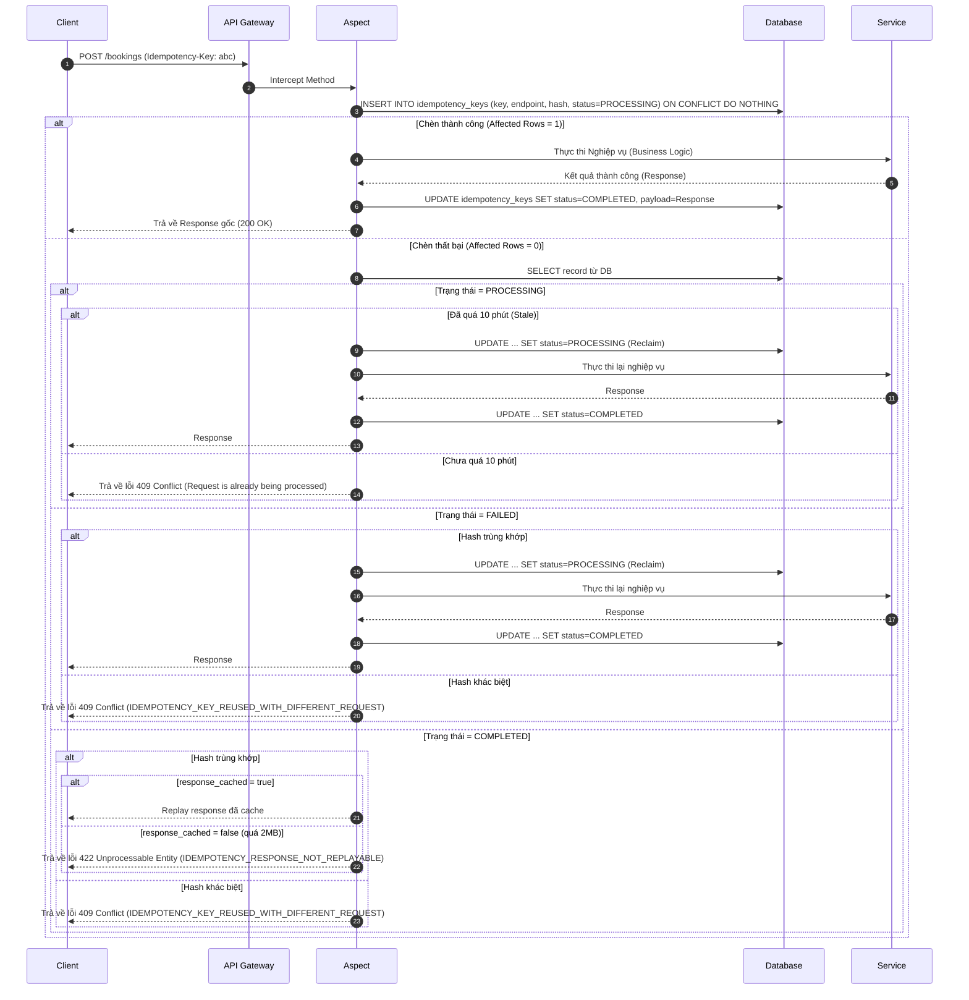

# Tài liệu Kỹ thuật: Chiến lược Chống trùng lặp mức API (API-Level Idempotency Keys)

Tài liệu này trình bày chi tiết kiến trúc, thiết kế cơ sở dữ liệu và quy trình tích hợp của cơ chế chống trùng lặp mức API (**API-Level Idempotency Keys**) trong hệ thống **OmniBooking**.

---

## 1. Tổng quan Kiến trúc

Trong môi trường phân tán, các sự cố về mạng, crash server, load balancer retry hoặc hành động click đúp của người dùng có thể dẫn đến việc Client gửi lại cùng một yêu cầu ghi.

Hệ thống OmniBooking áp dụng giải pháp chống trùng lặp mức API thông qua header `Idempotency-Key` (hoặc `X-Idempotency-Key`) dưới dạng UUID. Khác với cơ chế cache Redis thông thường, hệ thống sử dụng bảng cơ sở dữ liệu quan hệ (`idempotency_keys`) làm phân tầng lưu trữ bền vững nhằm đảm bảo:

- **Tính bất biến của Request Hash**: Tránh việc tái sử dụng key cho payload khác.
- **Tính nhất quán giao dịch**: Bảo vệ hệ thống khỏi double-process thông qua unique constraint mức DB.
- **Bền vững**: Cho phép lưu trữ và replay dữ liệu lâu dài (lên tới 7 ngày đối với Refund).

---

## 2. Thiết kế Cơ sở dữ liệu

Bảng `idempotency_keys` được định nghĩa trong Flyway migration script như sau:

```sql
CREATE TABLE idempotency_keys (
   id UUID PRIMARY KEY,
   idempotency_key VARCHAR(255) NOT NULL,
   endpoint VARCHAR(255) NOT NULL,
   request_hash VARCHAR(255) NOT NULL,
   response_payload JSONB,
   response_status INTEGER,
   processing_status VARCHAR(50) NOT NULL,
   response_cached BOOLEAN NOT NULL DEFAULT TRUE,
   created_at TIMESTAMP WITH TIME ZONE NOT NULL,
   expires_at TIMESTAMP WITH TIME ZONE NOT NULL,
   processing_started_at TIMESTAMP WITH TIME ZONE NOT NULL,
   CONSTRAINT uq_endpoint_idempotency_key UNIQUE (endpoint, idempotency_key)
);

CREATE INDEX idx_idempotency_keys_expires_at ON idempotency_keys (expires_at);
```

### Các thuộc tính chính:

- `uq_endpoint_idempotency_key`: Đảm bảo khóa idempotency chỉ duy nhất trong phạm vi của một API endpoint, tránh xung đột chéo giữa các nghiệp vụ khác nhau (ví dụ: tạo payment trùng key với yêu cầu refund).
- `processing_status`: Trạng thái xử lý gồm `PROCESSING`, `FAILED`, và `COMPLETED`.
- `response_cached`: Đánh dấu response payload có được lưu trữ hay không.

---

## 3. Quy trình Xử lý chi tiết



---

## 4. Tính Nhất Quán Giao Dịch & Khôi Phục Lỗi

Hệ thống phân tách rõ ranh giới giao dịch giữa Idempotency và Nghiệp vụ:

- **Khởi tạo khóa**: Thực hiện trong một giao dịch độc lập ngắn (`REQUIRES_NEW`) bằng Native SQL Insert để khóa concurrency được thiết lập và commit lập tức vào DB.
- **Thực thi nghiệp vụ**: Chạy trong giao dịch nghiệp vụ của chính `@Service` (nếu có `@Transactional`).
- **Cập nhật trạng thái**: Chạy trong một transaction ngắn khác sau khi nghiệp vụ hoàn thành.

### Các Kịch bản lỗi trên Production:

- **Nghiệp vụ commit thành công -> Cập nhật trạng thái Idempotency thất bại**:
  Thực thể nghiệp vụ đã được ghi nhận vào DB nhưng khóa vẫn ở trạng thái `PROCESSING`. Khi client retry sau 10 phút, hệ thống sẽ thực hiện reclaim và chạy lại. Tầng database nghiệp vụ với các ràng buộc duy nhất (UNIQUE constraint của riêng thực thể nghiệp vụ) sẽ đóng vai trò **lá chắn cuối cùng** chặn việc ghi nhận trùng lặp dữ liệu, đồng thời trả về lỗi nghiệp vụ rõ ràng cho client.
- **Ứng dụng crash đột ngột**:
  Bản ghi bị kẹt ở `PROCESSING` được tự động thu hồi (reclaim) sau 10 phút dựa trên cột `processing_started_at` khi client thực hiện gửi lại yêu cầu với cùng mã hash.

---

## 5. Giới hạn Kích thước & Dọn dẹp

- **Giới hạn 2 MB**: Nếu response payload lớn hơn 2 MB, hệ thống sẽ đặt cờ `response_cached = false` và không lưu payload vào DB nhằm tránh phình to kích thước cơ sở dữ liệu. Lượt retry sau sẽ nhận được HTTP `422 Unprocessable Entity` với lỗi `IDEMPOTENCY_RESPONSE_NOT_REPLAYABLE`.
- **Dọn dẹp theo lô (Batched Cleanup)**:
  Tiến trình Background Cleanup Worker chạy mỗi giờ một lần, thực hiện xóa các khóa đã hết hạn (`expires_at < NOW()`) theo từng lô (Batch Size = 1000) để đảm bảo không gây lock bảng hoặc quá tải transaction log của database.
  Chính sách TTL:
   - Booking Creation: 24 giờ.
   - Payment Initialization: 48 giờ.
   - Refund Requests: 7 ngày.
   - Coupon Redemption: 24 giờ.
