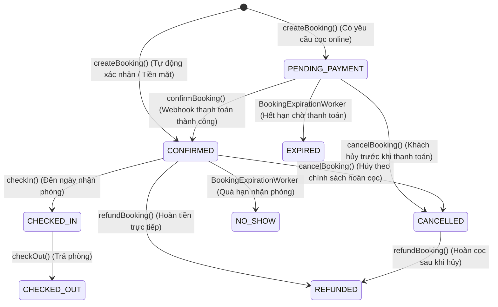

# Tài liệu Kỹ thuật: Vòng đời Đặt phòng (Booking Lifecycle)

Tài liệu này định nghĩa chi tiết các trạng thái đặt phòng (booking status), quy tắc chuyển đổi trạng thái và cơ chế vận hành của State Machine trong hệ thống **OmniBooking**.

---

## 1. Các Trạng thái Đặt phòng (Booking Statuses)

Hệ thống sử dụng enum `BookingStatus` để quản lý các trạng thái nghiệp vụ sau:

| Trạng thái        | Ý nghĩa                              | Trạng thái bắt đầu/Terminal              | Ghi chú                                                                                              |
| :---------------- | :----------------------------------- | :--------------------------------------- | :--------------------------------------------------------------------------------------------------- |
| `PENDING_PAYMENT` | Đang chờ khách thanh toán đặt cọc.   | Bắt đầu (nếu cần đặt cọc)                | Hoạt động như trạng thái **HOLD**. Giữ inventory phòng tạm thời. Có thời gian hết hạn (`expiresAt`). |
| `CONFIRMED`       | Đã xác nhận đặt phòng thành công.    | Bắt đầu (nếu cọc tiền mặt / tự xác nhận) | Chuyển sang từ `PENDING_PAYMENT` sau khi nhận webhook MoMo/Visa thành công.                          |
| `CHECKED_IN`      | Khách đã nhận phòng thực tế.         | Trạng thái trung gian                    | Chỉ cho phép chuyển tiếp từ ngày check-in thực tế.                                                   |
| `CHECKED_OUT`     | Khách đã trả phòng thành công.       | Terminal (Hoàn thành)                    | Giải phóng trạng thái lưu trú phòng trống.                                                           |
| `CANCELLED`       | Hủy đặt phòng.                       | Terminal (Hủy bỏ)                        | Khách hàng chủ động hủy hoặc quản trị viên hủy đặt phòng.                                            |
| `EXPIRED`         | Hết hạn chờ thanh toán.              | Terminal (Hủy do quá giờ)                | Hệ thống tự động chuyển trạng thái khi quá `expiresAt` mà chưa nhận được thanh toán.                 |
| `NO_SHOW`         | Khách không đến nhận phòng.          | Terminal (Vắng mặt)                      | Tự động chuyển bởi worker khi hết thời gian ân hạn nhận phòng (grace period).                        |
| `REFUNDED`        | Đã hoàn trả tiền đặt cọc/thanh toán. | Terminal (Hoàn tiền)                     | Trạng thái cuối cùng sau khi hoàn trả tiền thành công cho khách hàng từ CANCELLED hoặc CONFIRMED.    |

---

## 2. Sơ đồ Chuyển đổi Trạng thái (State Diagram)

Các trạng thái được kiểm soát chặt chẽ thông qua `BookingStateMachine`. Sơ đồ Mermaid dưới đây biểu diễn các đường chuyển trạng thái hợp lệ:



---

## 3. Quy tắc Chuyển đổi Trạng thái (Transition Rules)

Mọi thay đổi trạng thái bắt buộc phải thông qua `BookingStateMachine.transition()`. Việc gán trực tiếp `booking.setStatus()` và lưu cơ sở dữ liệu bị cấm tuyệt đối nhằm ngăn chặn lỗi logic nghiệp vụ.

### Bản đồ transitions hợp lệ trong Code:

```java
private static final Map<BookingStatus, Set<BookingStatus>> TRANSITIONS = Map.of(
      BookingStatus.PENDING_PAYMENT, Set.of(BookingStatus.CONFIRMED, BookingStatus.CANCELLED, BookingStatus.EXPIRED),
      BookingStatus.CONFIRMED, Set.of(BookingStatus.CHECKED_IN, BookingStatus.CANCELLED, BookingStatus.NO_SHOW, BookingStatus.REFUNDED),
      BookingStatus.CHECKED_IN, Set.of(BookingStatus.CHECKED_OUT),
      BookingStatus.CANCELLED, Set.of(BookingStatus.REFUNDED)
);
```

### Ràng buộc nghiệp vụ bổ sung (Business Rules):

1. **CHECKED_IN**: Chỉ được chuyển tiếp khi ngày hiện tại bằng hoặc sau ngày `checkInDate` của booking.
2. **CHECKED_OUT**: Chỉ được chuyển tiếp khi ngày hiện tại bằng hoặc sau ngày `checkOutDate` của booking.
3. **NO_SHOW**: Chỉ được đánh dấu khi thời điểm hiện tại đã vượt quá thời hạn ân hạn nhận phòng (`checkInDate` đầu ngày + `noShowGracePeriodHours`).

---

## 4. Nhật ký Trạng thái (Audit Log)

Mỗi lần trạng thái thay đổi thành công, hệ thống sẽ tự động lưu lại thông tin đối soát vào bảng `booking_status_logs` (thông qua thực thể `BookingStatusLog`):

- `old_status`: Trạng thái trước khi chuyển.
- `new_status`: Trạng thái đích.
- `reason`: Lý do chuyển đổi trạng thái (ví dụ: "Thanh toán cọc Momo", "Worker tự động quét hết hạn").
- `changed_by`: Người dùng hoặc tiến trình thực hiện thay đổi.
- `created_at`: Mốc thời gian chính xác ghi nhận thay đổi.
