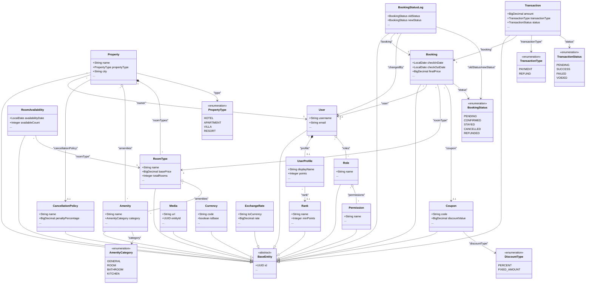

# OmniBooking Class Diagram

This document contains a simplified Class Diagram for the domain models (entities) of the **OmniBooking** project, built using **Mermaid**. Classes have been trimmed to show only 2-3 core attributes along with a `...` symbol to represent omitted fields, ensuring a clean and readable layout within Mermaid's rendering boundaries.

## 1. Mermaid Class Diagram

## 2. Modules & Relationships Breakdown

### 2.1. User Management Module

- **BaseEntity**: An abstract class defining shared fields such as the UUID v7 primary key (`id`), optimistic locking field (`version`), and auditing/soft-delete timestamps.
- **User & UserProfile**: A 1-to-1 relationship implemented via `@MapsId`. `UserProfile` holds extended profile data including user points (`points`) and rank (`rank`).
- **Role & Permission**: A many-to-many (`@ManyToMany`) relationship. Each user is assigned a set of roles, and each role defines a list of specific permissions.

### 2.2. Property Management Module

- **Property**: Represents an accommodation establishment (Hotel, Villa, Apartment, etc.) managed by an owner (`User` with a Partner or Admin role).
- **RoomType**: Represents a specific type of room offered by a property. It holds base pricing (`basePrice`), capacity, size, and bed configuration.
- **Amenity**: Standard convenience features that can be linked via many-to-many associations to both properties and room types.
- **RoomAvailability**: Manages daily inventory counts and handles seasonal or event-based price overrides.

### 2.3. Booking & Transaction Module

- **Booking**: A reservation record linking a customer (`User`), a selected room type (`RoomType`), check-in/check-out dates, and discount coupon applications (`Coupon`).
- **BookingStatusLog**: A status transition log (e.g., Pending -> Confirmed -> Stayed -> Cancelled -> Refunded) ensuring auditability for every booking status change.
- **Transaction**: Tracks payment and refund transactions associated with bookings, including a JSONB `metadata` column for payment gateway integration (Stripe, etc.).
- **CancellationPolicy**: Defines properties' cancellation policies, such as the free cancellation window and penalty percentages.

### 2.4. Auxiliary Systems

- **Media**: Polymorphic media storage hosting uploaded assets on Cloudinary, dynamically mapped via `entityId` and `entityType` to various entities (properties, room types, user profiles, etc.).
- **Currency & ExchangeRate**: Multi-currency and real-time exchange rate caching structures used for on-the-fly price conversion.
