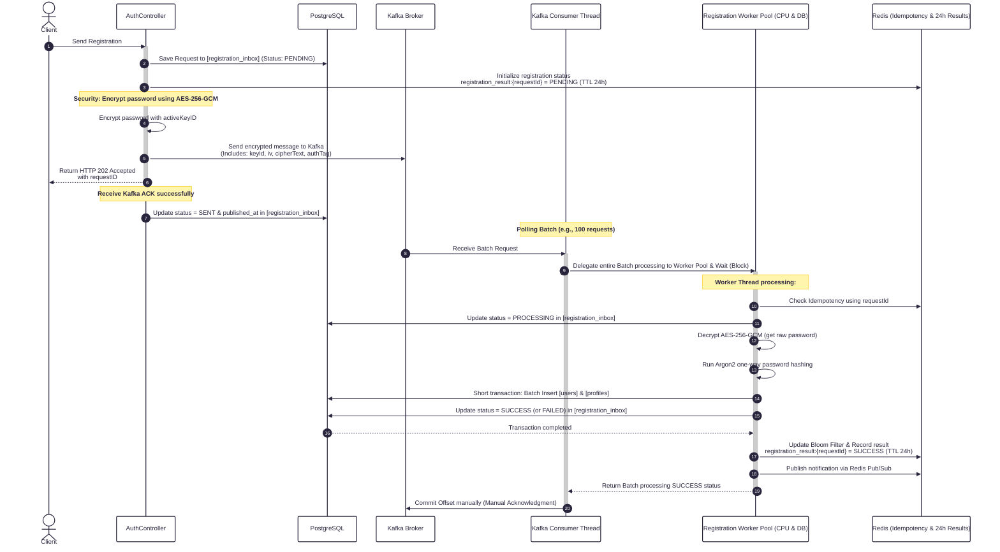
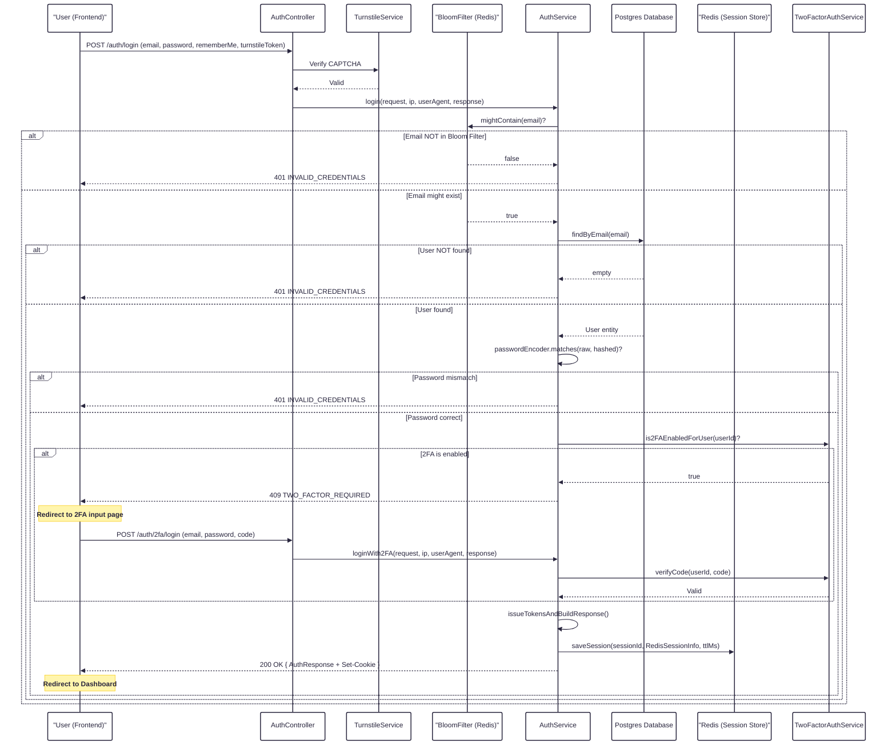

# High-Concurrency Authentication Architecture (World Cup Scale)

This document provides a comprehensive technical reference for the **Authentication System** in OmniBooking — covering **Registration**, **Login**, **Session Lifecycle**, **Token Management**, **OAuth2**, **Two-Factor Authentication (2FA)**, **Passkeys (WebAuthn)**, and all associated **Security Mechanisms**.

> **Design Goal:** Handle 100k+ concurrent authentication requests per second with sub-second response times, zero data loss, defense-in-depth security, and a highly responsive database layer.

---

## Table of Contents

- [1. Architectural Overview](#1-architectural-overview)
- [2. Registration Flow (High-Concurrency & Durable)](#2-registration-flow-high-concurrency--durable)
   - [2.1 Sequence Diagram](#21-sequence-diagram)
   - [2.2 Detailed Processing Flow](#22-detailed-processing-flow)
   - [2.3 Phase 1: Reception & Durable Ingestion (The Inbox)](#23-phase-1-reception--durable-ingestion-the-inbox)
   - [2.4 Phase 2: Security & Key Versioning (AES-256-GCM)](#24-phase-2-security--key-versioning-aes-256-gcm)
   - [2.5 Phase 3: Decoupled Processing (The Worker Pool)](#25-phase-3-decoupled-processing-the-worker-pool)
   - [2.6 Phase 4: Batch Persistence (PostgreSQL Batching)](#26-phase-4-batch-persistence-postgresql-batching)
   - [2.7 Phase 5: Notification & Durable Results](#27-phase-5-notification--durable-results)
   - [2.8 Inbox Recovery & Cleanup Schedulers](#28-inbox-recovery--cleanup-schedulers)
- [3. Login Flow](#3-login-flow)
   - [3.1 Sequence Diagram](#31-sequence-diagram)
   - [3.2 Standard Login (Email/Password)](#32-standard-login-emailpassword)
   - [3.3 Login with Two-Factor Authentication (2FA)](#33-login-with-two-factor-authentication-2fa)
   - [3.4 OAuth2 Login (Google)](#34-oauth2-login-google)
   - [3.5 Guest Account Activation](#35-guest-account-activation)
- [4. Session & Token Lifecycle](#4-session--token-lifecycle)
   - [4.1 Token Issuance (`issueTokensAndBuildResponse`)](#41-token-issuance-issuetokensandbuildresponse)
   - [4.2 Cookie Architecture](#42-cookie-architecture)
   - [4.3 JWT Access Token Structure](#43-jwt-access-token-structure)
   - [4.4 Redis Session Store (`RedisSessionInfo`)](#44-redis-session-store-redissessioninfo)
   - [4.5 Session TTL & Sliding Window](#45-session-ttl--sliding-window)
   - [4.6 Token Refresh Flow](#46-token-refresh-flow)
   - [4.7 Logout & Session Revocation](#47-logout--session-revocation)
- [5. Security Mechanisms](#5-security-mechanisms)
   - [5.1 Security Filter Chain](#51-security-filter-chain)
   - [5.2 JWT Authentication Filter](#52-jwt-authentication-filter)
   - [5.3 CSRF Protection (Double-Submit Cookie)](#53-csrf-protection-double-submit-cookie)
   - [5.4 Session Fingerprinting (`x_fgp`)](#54-session-fingerprinting-x_fgp)
   - [5.5 Bloom Filter (Email Pre-check)](#55-bloom-filter-email-pre-check)
   - [5.6 CAPTCHA (Cloudflare Turnstile)](#56-captcha-cloudflare-turnstile)
   - [5.7 Idempotency Protection](#57-idempotency-protection)
   - [5.8 Password Hashing (Argon2)](#58-password-hashing-argon2)
   - [5.9 AES Encryption Key Rotation (Key Versioning & Caching)](#59-aes-encryption-key-rotation-key-versioning--caching)
   - [5.10 CPU Pool Saturation & Backpressure Control](#510-cpu-pool-saturation--backpressure-control)
   - [5.11 Token Version & Force Logout](#511-token-version--force-logout)
   - [5.12 Rate Limiting](#512-rate-limiting)
- [6. Two-Factor Authentication (2FA) — TOTP](#6-two-factor-authentication-2fa--totp)
- [7. Passkeys (WebAuthn)](#7-passkeys-webauthn)
- [8. Email Verification & Password Reset](#8-email-verification--password-reset)
- [9. Cross-Domain Cookie Architecture (Monorepo)](#9-cross-domain-cookie-architecture-monorepo)
- [10. API Reference](#10-api-reference)
- [11. Performance Benefits](#11-performance-benefits)
- [12. Redis Keys & Kafka Topics Reference](#12-redis-keys--kafka-topics-reference)
- [13. Maintenance Notes](#13-maintenance-notes)

---

## 1. Architectural Overview

The OmniBooking Authentication system is built on a **stateful-session + stateless-JWT hybrid** model:

- **JWT** for short-lived, self-contained access tokens (15-minute expiry).
- **Redis** for server-side session state, distributed locking, caching, Bloom Filter, and Pub/Sub.
- **Cookies** for secure, HttpOnly token transport (no localStorage).
- **Kafka** for registration queue ingestion, asynchronous event processing (email verification, CDC), and DLT recovery.
- **PostgreSQL Inbox Table** for durable, write-ahead registration buffering.

### Key Components

```
┌──────────────────────────────────────────────────────────────────────┐
│                        Frontend (Next.js)                            │
│   apps/web (:3000)  │  apps/partner (:3002)  │  apps/owner (:3005)   │
└──────────┬───────────────────┬────────────────────────┬──────────────┘
           │  Rewrite Proxy    │                        │
           ▼                   ▼                        ▼
┌──────────────────────────────────────────────────────────────────────┐
│                    Spring Boot API (:8080)                           │
│  ┌─────────────┐  ┌──────────────┐  ┌────────────────────────┐       │
│  │ AuthCtrl    │  │ SecurityCfg  │  │ JwtAuthFilter          │       │
│  │ 2FA Ctrl    │  │ CsrfFilter   │  │ CustomCsrfFilter       │       │
│  │ PasskeyCtrl │  │ CorsConfig   │  │ IdempotencyAspect      │       │
│  └─────┬───────┘  └──────────────┘  └────────────────────────┘       │
│        │                                                             │
│  ┌─────▼──────────────────────────────────────────────────────┐      │
│  │                    AuthService                             │      │
│  │  register() │ login() │ loginWith2FA() │ loginWithOAuth2() │      │
│  │  refresh()  │ logout()│ finalizeRegistration()             │      │
│  └────┬───────────┬───────────────┬───────────────────────────┘      │
│       │           │               │                                  │
│  ┌────▼───┐  ┌────▼────┐  ┌───────▼───────┐  ┌───────────────────┐   │
│  │ JWTSvc │  │ Session │  │  BloomFilter  │  │  Registration     │   │
│  │        │  │ Service │  │  Service      │  │  Kafka Consumer   │   │
│  └────────┘  └───┬─────┘  └───────────────┘  └────────┬──────────┘   │
│                  │                                    │              │
└──────────────────┼────────────────────────────────────┼──────────────┘
                   │                                    │
          ┌────────▼──────────┐                ┌────────▼─────────┐
          │    Redis          │                │    PostgreSQL    │
          │ Sessions/Cache    │                │  Inbox/Outbox DB │
          │ Bloom/PubSub      │                │  Users/Profiles  │
          └───────────────────┘                └────────┬─────────┘
                                                        │
                                                ┌───────▼──────────┐
                                                │     Kafka        │
                                                │  Registration /  │
                                                │  CDC / DLT Topics│
                                                └──────────────────┘
```

---

## 2. Registration Flow (High-Concurrency & Durable)

OmniBooking utilizes a **durable inbox buffering pattern with Kafka-based batch consumer processing** to ingest and process registrations securely under high load.

### 2.1 Sequence Diagram


> **Note**: Looking for the deprecated Redis Queue-based V1 registration flow sequence diagram? You can find it at [high-concurrency-registration-v1.png](./sequence-diagrams/high-concurrency-registration-v1.png).

<details>
<summary>View Diagram Source (Mermaid)</summary>



</details>

### 2.2 Detailed Processing Flow

| Step | Component                   | Action                                                                                                                                                              |
| :--- | :-------------------------- | :------------------------------------------------------------------------------------------------------------------------------------------------------------------ |
| 1    | `AuthController`            | Receives `POST /auth/register`, verifies Turnstile CAPTCHA.                                                                                                         |
| 2    | `RegistrationQueueService`  | Generates a PostgreSQL `registration_inbox` record with status `PENDING`. Initializes Redis `registration_result:{requestId}` to `PENDING` (24h TTL).               |
| 3    | `EncryptionService`         | Encrypts raw password using AES-256-GCM with the active `keyId` (e.g. `aes-v2`).                                                                                    |
| 4    | `KafkaTemplate`             | Publishes the JSON message to topic `registration-request-topic` with `email` as the partition key.                                                                 |
| 5    | `Kafka Producer callback`   | Receives broker acknowledgement (ACK), updates status in `registration_inbox` to `SENT` and sets `published_at`.                                                    |
| 6    | Frontend                    | Receives `202 Accepted` and connects to SSE stream `GET /auth/subscribe/{requestId}`.                                                                               |
| 7    | `RegistrationKafkaConsumer` | Polls a batch of records, wraps them, and synchronous blocks while delegating the work to the platform thread executor (`registrationCpuExecutor`).                 |
| 8    | `RegistrationWorker`        | Performs Redis idempotency deduplication (`registration_idempotency:{requestId}`).                                                                                  |
| 9    | `RegistrationWorker`        | Updates PG inbox status for the request to `PROCESSING`.                                                                                                            |
| 10   | `RegistrationWorker`        | Decrypts GCM ciphertext via versioned key cache, runs Argon2 hashing (CPU-bound) in parallel.                                                                       |
| 11   | `RegistrationService`       | Executes database transactions: Batch inserts into `users` & `user_profiles`, updates PG inbox status to `SUCCESS` (or `FAILED` on validation/duplicate violation). |
| 12   | `RegistrationService`       | Updates Bloom Filter, caches result in Redis (`registration_result:{requestId}` = `SUCCESS`, 24h TTL), and publishes completion message via Redis Pub/Sub.          |
| 13   | `RegistrationKafkaConsumer` | Receives task completion, calls manual offset commit `acknowledgment.acknowledge()`.                                                                                |
| 14   | `SseNotificationService`    | Delivers `REGISTRATION_COMPLETE` SSE event to client.                                                                                                               |

---

### 2.3 Phase 1: Reception & Durable Ingestion (The Inbox)

**Controller:** [`AuthController.register()`](../Server/src/main/java/com/omnibooking/controller/AuthController.java)

The request is received, schema-validated, and verified with CAPTCHA. It is immediately pushed to a durable PostgreSQL-backed write-ahead log (`registration_inbox` table) as `PENDING`.

```java
@Anonymous
@Idempotent
@PostMapping("/register")
public ResponseEntity<ApiResponse<Void>> register(@Valid @RequestBody RegisterRequest request,
      HttpServletRequest httpRequest) {
   turnstileService.verifyToken(request.getTurnstileToken(), ip);
   String requestId = (String) httpRequest.getAttribute("requestId");
   request.setRequestId(requestId);

   // Durable PostgreSQL Inbox save + AES encryption + Kafka publish
   registrationQueueService.pushToQueue(request);

   return ResponseEntity.status(HttpStatus.ACCEPTED)
         .body(ApiResponse.success(null, "Registration request received", requestId));
}
```

**Inbox Table Definition:**

```sql
CREATE TABLE IF NOT EXISTS registration_inbox (
    request_id UUID PRIMARY KEY,
    payload JSONB NOT NULL,
    status VARCHAR(20) NOT NULL, -- PENDING, SENT, PROCESSING, SUCCESS, FAILED
    created_at TIMESTAMP WITH TIME ZONE DEFAULT CURRENT_TIMESTAMP NOT NULL,
    published_at TIMESTAMP WITH TIME ZONE
);
```

---

### 2.4 Phase 2: Security & Key Versioning (AES-256-GCM)

To prevent plaintext passwords from being stored on disk inside Kafka partitions or backups, the request password is encrypted at ingress using **AES-256-GCM** before publishing.

**Kafka Payload DTO (`RegistrationMessage`):**

```json
{
   "requestId": "550e8400-e29b-41d4-a716-446655440000",
   "email": "user@example.com",
   "fullName": "John Doe",
   "keyId": "aes-v2",
   "encryptedPassword": "base64(iv + ciphertext + tag)"
}
```

- **Encryption Key Versioning**: The payload explicitly specifies the `keyId` used to encrypt it, allowing zero-downtime key rotation.
- **Encryption Overhead**: Negligible (<1ms) compared to the expensive Argon2 hashing done later.

---

### 2.5 Phase 3: Decoupled Processing (The Worker Pool)

The consumer is split into a **Lightweight Coordinator** (Kafka Consumer Thread) and a **Heavy Processor** (Registration Worker Pool).

**Lightweight Consumer:** [`RegistrationKafkaConsumer.consumeBatch()`](../Server/src/main/java/com/omnibooking/consumer/RegistrationKafkaConsumer.java)

The Consumer thread is kept extremely responsive by offloading all tasks (decryption, validation, Argon2 hashing, DB transaction writes) to a platform thread pool (`registrationCpuExecutor`). The Consumer thread blocks on the future to wait for completion, ensuring manual offset commit is only executed after successful DB commit:

```java
@KafkaListener(
      topics = "${omnibooking.kafka.registration.topic-name:registration-request-topic}",
      groupId = "registration-workers",
      containerFactory = "registrationListenerContainerFactory"
)
public void consumeBatch(List<ConsumerRecord<String, RegistrationMessage>> records, Acknowledgment acknowledgment) {
   CompletableFuture<Void> batchTask = CompletableFuture.runAsync(() -> {
      processBatch(records);
   }, executor);

   try {
      batchTask.get(); // Synchronous block for backpressure
      acknowledgment.acknowledge(); // Manual offset commit
   } catch (Exception e) {
      throw new RuntimeException("Kafka batch processing failed", e);
   }
}
```

---

### 2.6 Phase 4: Batch Persistence (PostgreSQL Batching)

Argon2 hashing is performed in parallel within the worker threads. Once prepared, the entities are saved to PostgreSQL inside a single, fast database transaction.

**JPA Batch Insert Configuration:**
Spring Data JPA `saveAll` is optimized for bulk operations by setting client-side generated UUIDs (UUID v7 via `UuidCreator.getTimeOrderedEpoch()`) so Hibernate does not disable batching (which occurs with auto-increment `IDENTITY` keys).

**Properties in `application.properties`:**

```properties
spring.jpa.properties.hibernate.jdbc.batch_size=100
spring.jpa.properties.hibernate.order_inserts=true
spring.jpa.properties.hibernate.order_updates=true
```

**Transaction Time Drop:**
By offloading Argon2 hashing outside the database transaction, transaction lock hold time is reduced from **~10 seconds per batch to <100ms**, completely preventing connection pool starvation.

---

### 2.7 Phase 5: Notification & Durable Results

Once saved, the worker:

1. Adds the email to the Bloom Filter (`bf:user_emails`).
2. Updates `registration_result:{requestId}` in Redis to `SUCCESS` with a **24-hour TTL** (Durable Result).
3. Publishes a real-time event to the Redis Pub/Sub topic `REGISTRATION_TOPIC`.
4. Client's SSE stream (`SseNotificationService`) receives the event and completes registration.

**Durable State Recovery:**
Since `registration_result:{requestId}` is persisted in Redis for 24 hours, if the client experiences a connection drop or browser crash, it can securely reconnect and fetch the state, preventing hanging client UIs.

---

### 2.8 Inbox Recovery & Cleanup Schedulers

**Scheduler:** [`RegistrationInboxWorker`](../Server/src/main/java/com/omnibooking/worker/RegistrationInboxWorker.java)

1. **Inbox Recovery Job (`@Scheduled(fixedDelay = 30000)`)**:
   - Scans for `PENDING` records in `registration_inbox` older than 15 seconds (representing publish failures when Kafka is offline) and republishes them to Kafka.
   - Scans for `PROCESSING` records older than 5 minutes (representing worker node crash mid-processing) and resets them to `PENDING` for retry.
   - Guarantees **eventual delivery** (zero request loss).
2. **Inbox Cleanup Job (`@Scheduled(cron = "0 0 2 * * *")`)**:
   - Daily at 2 AM, deletes processed `SUCCESS` records older than **7 days**.
   - Deletes failed `FAILED` records older than **30 days** (kept for diagnostics).

---

## 3. Login Flow

### 3.1 Sequence Diagram


<details>
<summary>View Login Flow Diagram Source (Mermaid)</summary>



</details>

### 3.2 Standard Login (Email/Password)

**Endpoint:** `POST /auth/login`

**Controller:** [`AuthController.login()`](../Server/src/main/java/com/omnibooking/controller/AuthController.java)

**`LoginRequest` DTO:**

| Field            | Type      | Validation                  |
| :--------------- | :-------- | :-------------------------- |
| `email`          | `String`  | `@NotBlank`, `@Email`       |
| `password`       | `String`  | `@NotBlank`                 |
| `rememberMe`     | `boolean` | Optional (default: `false`) |
| `turnstileToken` | `String`  | Optional (CAPTCHA)          |

**Processing steps** ([`AuthServiceImpl.login()`](../Server/src/main/java/com/omnibooking/services/auth/impl/AuthServiceImpl.java)):

1. **Bloom Filter Pre-check**: `bloomFilterService.mightContain(email)` — if `false`, immediately reject with `INVALID_CREDENTIALS` (no DB query needed). This eliminates 99%+ of invalid email lookups.
2. **DB Lookup**: `userRepository.findByEmail(email)` — throws `INVALID_CREDENTIALS` if not found.
3. **Password Verification**: `passwordEncoder.matches(raw, hashed)` — Argon2 comparison. Throws `INVALID_CREDENTIALS` on mismatch.
4. **2FA Check**: `twoFactorAuthService.is2FAEnabledForUser(userId)` — if 2FA is enabled, throws `TWO_FACTOR_REQUIRED` error (HTTP 409), signaling the frontend to redirect to the 2FA input form.
5. **Session Issuance**: Calls `issueTokensAndBuildResponse()` (see [Section 4.1](#41-token-issuance-issuetokensandbuildresponse)).

> **Security Note:** The error message is always `INVALID_CREDENTIALS` for both "user not found" and "wrong password" cases. This prevents user enumeration attacks.

### 3.3 Login with Two-Factor Authentication (2FA)

**Endpoint:** `POST /auth/2fa/login`

**Controller:** [`TwoFactorController.loginWith2FA()`](../Server/src/main/java/com/omnibooking/controller/TwoFactorController.java)

When the standard login returns `TWO_FACTOR_REQUIRED`, the frontend collects the TOTP code and sends:

```json
{
   "email": "user@example.com",
   "password": "userPassword",
   "code": "123456",
   "rememberMe": true
}
```

**Processing steps** ([`AuthServiceImpl.loginWith2FA()`](../Server/src/main/java/com/omnibooking/services/auth/impl/AuthServiceImpl.java)):

1. **Bloom Filter Pre-check** (same as standard login).
2. **DB Lookup + Password Verification** (same as standard login).
3. **TOTP Code Verification**: `twoFactorAuthService.verifyCode(userId, code)`:
   - Decrypts stored TOTP secret (encrypted at rest via `EncryptionService`).
   - Verifies using `DefaultCodeVerifier` (SHA1, 6 digits, 30s period).
   - **Replay Prevention**: Redis key `totp:used:{userId}:{code}` with 60s TTL.
   - **Rate Limiting**: 5 failed attempts → 15-minute lockout via `totp:lock:{userId}`.
   - **Backup Code Fallback**: If TOTP fails, checks against hashed backup codes (Argon2). Consumed on use.
4. **Session Issuance**: Calls `issueTokensAndBuildResponse()`.

### 3.4 OAuth2 Login (Google)

**Endpoints:**

- `GET /auth/{provider}/url` — Returns the OAuth2 authorization URL
- `GET /auth/{provider}/callback` — Handles the OAuth2 callback

**Processing steps** ([`AuthServiceImpl.loginWithOAuth2()`](../Server/src/main/java/com/omnibooking/services/auth/impl/AuthServiceImpl.java)):

1. **State Validation**: OAuth2 `state` parameter validated via Redis key `oauth2_state:{state}` (15-min TTL).
2. **Token Exchange**: Exchanges authorization code for user info (`OAuth2UserInfo`: id, email, name, picture).
3. **Account Resolution**:
   - If `SocialAccount` exists → fetch linked `User`, sync profile (avatar, displayName, verified status).
   - If `SocialAccount` doesn't exist but `User` with same email exists → link social account to existing user.
   - If no `User` exists → create new `User` + `UserProfile` + `SocialAccount`. No password required. Auto-verified.
4. **Bloom Filter Update**: `bloomFilterService.add(email)` for new users.
5. **Session Issuance**: Calls `issueTokensAndBuildResponse()`.
6. **Redirect**: Redirects to frontend callback URL (success or `?error=auth_failed`).

### 3.5 Guest Account Activation

**Endpoint:** `POST /auth/activate-guest`

For users who were created as guests (e.g., during a booking), this endpoint allows them to set a password and activate their account:

```json
{
   "token": "verification-token-uuid",
   "password": "newSecurePassword"
}
```

**Processing steps** ([`AuthServiceImpl.activateGuest()`](../Server/src/main/java/com/omnibooking/services/auth/impl/AuthServiceImpl.java)):

1. **Token Verification**: `verificationService.verifyToken(token)` → returns `userId`.
2. **Set Password**: Encodes password with Argon2, sets `isActive = true`.
3. **Update Profile**: Sets `isVerified = true`.
4. **Session Issuance**: Calls `issueTokensAndBuildResponse()`.

---

## 4. Session & Token Lifecycle

### 4.1 Token Issuance (`issueTokensAndBuildResponse`)

This is the **centralized method** used by ALL authentication flows (register, login, 2FA, OAuth2, refresh, upgrade) to create sessions and set cookies.

**Source:** [`AuthServiceImpl.issueTokensAndBuildResponse()`](../Server/src/main/java/com/omnibooking/services/auth/impl/AuthServiceImpl.java)

```
Input Parameters:
  User, roles, profile, ip, userAgent, response, rememberMe, createdAt, lastAccessedAt, oldSessionId

Processing:
  ① Generate UUIDv7: sessionId, refreshToken (via UuidCreator.getTimeOrderedEpoch())
  ② Generate fingerprint: random UUIDv7 → SHA-256 hash
  ③ Generate JWT: userId + roles + sessionId + fingerprintHash + tokenVersion → signed with HMAC-SHA
  ④ Calculate TTL: sliding window + hard cap logic
  ⑤ Build RedisSessionInfo: userId, username, email, fullName, roles, hashedRefreshToken (Argon2), ip, userAgent, createdAt, lastAccessedAt, rememberMe
  ⑥ Save session to Redis: key = "refresh:{sessionId}", TTL = finalTtlMs
  ⑦ Verify session was saved correctly (read-after-write)
  ⑧ Delete old session if rotating (refresh flow)
  ⑨ Set cookies: access_token, session_id, refresh_token, x_fgp, csrf_token
  ⑩ Return AuthResponse: id, username, email, fullName, avatarUrl, roles, reputationScore, isVerified, rankName, partnerBio
```

### 4.2 Cookie Architecture

All cookies are set by the Spring Boot backend via `Set-Cookie` headers using the [`CookieUtils`](../Server/src/main/java/com/omnibooking/util/CookieUtils.java) utility class.

| Cookie Name     | HttpOnly | Secure       | SameSite | Max-Age                | Purpose                                                    |
| :-------------- | :------- | :----------- | :------- | :--------------------- | :--------------------------------------------------------- |
| `access_token`  | Yes      | Configurable | Lax      | **15 minutes** (fixed) | JWT access token for API authentication                    |
| `session_id`    | Yes      | Configurable | Lax      | Session TTL            | Links to `RedisSessionInfo` for stateful verification      |
| `refresh_token` | Yes      | Configurable | Lax      | Session TTL            | Used to rotate session and issue new `access_token`        |
| `x_fgp`         | Yes      | Configurable | Lax      | Session TTL            | Random fingerprint bound to JWT via SHA-256 hash           |
| `csrf_token`    | No       | Configurable | Lax      | Session TTL            | CSRF token readable by client JS for Double-Submit pattern |

> **Domain Scoping:** In production, `COOKIE_DOMAIN` is set to `.yourdomain.com` (wildcard) so all 3 Next.js apps share cookies. In local dev, domain is omitted — RFC 6265 ignores ports, so cookies flow across `:3000`, `:3002`, `:3005`.

### 4.3 JWT Access Token Structure

**Library:** `io.jsonwebtoken` (JJWT)
**Algorithm:** HMAC-SHA (symmetric)
**Default Expiry:** 15 minutes (`app.security.jwt-expiration-ms`)

**JWT Claims:**

| Claim          | Type            | Description                                                                  |
| :------------- | :-------------- | :--------------------------------------------------------------------------- |
| `sub`          | `String` (UUID) | User ID                                                                      |
| `roles`        | `List<String>`  | User roles (e.g., `["ROLE_USER", "ROLE_PARTNER"]`)                           |
| `sessionId`    | `String` (UUID) | Links to Redis session for stateful verification                             |
| `fgh`          | `String`        | SHA-256 hash of the `x_fgp` cookie fingerprint                               |
| `tokenVersion` | `Integer`       | Used for force-logout (see [Section 5.11](#511-token-version--force-logout)) |
| `iat`          | `Date`          | Issued at timestamp                                                          |
| `exp`          | `Date`          | Expiration timestamp                                                         |

### 4.4 Redis Session Store (`RedisSessionInfo`)

**Redis Key:** `refresh:{sessionId}` (UUID)

**Source:** [`RedisSessionInfo`](../Server/src/main/java/com/omnibooking/security/RedisSessionInfo.java)

| Field                | Type          | Description                               |
| :------------------- | :------------ | :---------------------------------------- |
| `userId`             | `UUID`        | User identifier                           |
| `username`           | `String`      | Username (defaults to email)              |
| `email`              | `String`      | User email                                |
| `fullName`           | `String`      | Display name from profile                 |
| `roles`              | `Set<String>` | User roles                                |
| `hashedRefreshToken` | `String`      | **Argon2 hash** of the refresh token UUID |
| `ip`                 | `String`      | Client IP at session creation/refresh     |
| `userAgent`          | `String`      | Browser User-Agent string                 |
| `createdAt`          | `long`        | Session creation timestamp (epoch ms)     |
| `lastAccessedAt`     | `long`        | Last refresh/access timestamp (epoch ms)  |
| `rememberMe`         | `boolean`     | Whether "Remember Me" was selected        |

**User Sessions Index:** `user_sessions:{userId}` — Redis Sorted Set containing all active session IDs for a user, scored by expiry timestamp. Hard expiry: 30 days.

### 4.5 Session TTL & Sliding Window

The session TTL uses a **Flexible Sliding Window** strategy with **Hard Caps**:

| Setting            | Normal Session | Remember Me Session |
| :----------------- | :------------- | :------------------ |
| **Sliding Window** | 1 day          | 1–7 days (adaptive) |
| **Hard Cap**       | 3 days         | 30 days             |

**Flexible Sliding Window (Remember Me):**

```java
long maxDays = 7;  // SESSION_SLIDING_REMEMBER_ME_MS
long offDays = (now - lastAccessedAt) / DAY_MS;  // Days since last activity
long extensionDays = Math.max(1, maxDays - offDays + 1);  // Decreasing extension
if (extensionDays > maxDays) extensionDays = maxDays;
slidingMs = extensionDays * DAY_MS;
```

- **Active users** (accessed recently): Get longer extensions (up to 7 days).
- **Inactive users** (long gap): Get shorter extensions (minimum 1 day).
- **Hard cap enforcement**: `finalTtl = min(slidingMs, hardCapMs - elapsed)`.

### 4.6 Token Refresh Flow

**Endpoint:** `POST /auth/refresh`

**Source:** [`AuthServiceImpl.refresh()`](../Server/src/main/java/com/omnibooking/services/auth/impl/AuthServiceImpl.java)

```
① Extract session_id and refresh_token from cookies
② Validate UUID format → clear cookies on failure
③ Acquire distributed lock: SETNX "lock:refresh:{sessionId}" with 5s TTL
④ Verify session: Redis lookup + Argon2.matches(refreshToken, hashedRefreshToken)
⑤ Check hard cap: if elapsed >= hardCap → delete session, clear cookies, reject
⑥ Issue new tokens: issueTokensAndBuildResponse(oldSessionId = current)
   → Creates new session, deletes old session (atomic rotation)
⑦ Release lock: Lua script (compare-and-delete)
```

**Concurrency Protection:** Redis distributed lock (`lock:refresh:{sessionId}`) prevents race conditions when multiple tabs attempt simultaneous refresh. If a lock is already held, the request is rejected with `INVALID_SESSION` and a Micrometer counter `omnibooking.auth.lock.contention` is incremented.

**Lock Release (Lua Script):**

```lua
if redis.call('get', KEYS[1]) == ARGV[1] then
     return redis.call('del', KEYS[1])
else
     return 0
end
```

### 4.7 Logout & Session Revocation

**Endpoint:** `POST /auth/logout`

**Source:** [`AuthServiceImpl.logout()`](../Server/src/main/java/com/omnibooking/services/auth/impl/AuthServiceImpl.java)

1. Verify `userId` matches session ownership.
2. Delete session from Redis (`refresh:{sessionId}`).
3. Remove from user sessions index (`user_sessions:{userId}`).
4. Clear all auth cookies.

**Global Logout (All Devices):**

`SessionService.revokeAllUserSessions(userId)`:

1. Fetch all session IDs from `user_sessions:{userId}` sorted set.
2. Delete each `refresh:{sessionId}` key.
3. Delete the index key.

> This is triggered during password reset with `logoutAll = true`.

---

## 5. Security Mechanisms

### 5.1 Security Filter Chain

**Source:** [`SecurityConfig`](../Server/src/main/java/com/omnibooking/security/SecurityConfig.java)

```
Request → CORS Filter → JwtAuthenticationFilter → CustomCsrfFilter → Controller
```

| Configuration      | Value                                                                 |
| :----------------- | :-------------------------------------------------------------------- |
| Session Management | `STATELESS` (no server-side HTTP sessions)                            |
| Password Encoder   | **Argon2** (`Argon2PasswordEncoder.defaultsForSpringSecurity_v5_8()`) |
| Spring CSRF        | **Disabled** (custom implementation used)                             |
| CORS               | Configurable via `app.cors.allowed-origins`                           |

**Public Endpoints (No Auth Required):**

- `/auth/login`, `/auth/register`, `/auth/verify`, `/auth/refresh`, `/auth/logout`
- `/auth/2fa/login`, `/auth/forgot-password`, `/auth/reset-password`
- `/auth/google/**`, `/auth/subscribe/**`, `/auth/finalize-registration`
- `/auth/check-email`, `/auth/activate-guest`, `/auth/csrf`
- `/bookings` (POST + GET), `/payments/**`, `/properties/search/**`
- `/destinations/**`, `/health/**`, `/swagger-ui/**`, `/actuator/**`

**Authenticated Endpoints:**

- `/auth/passkey/**` — WebAuthn operations
- All other endpoints (`anyRequest().authenticated()`)

### 5.2 JWT Authentication Filter

**Source:** [`JwtAuthenticationFilter`](../Server/src/main/java/com/omnibooking/security/JwtAuthenticationFilter.java)

The filter performs **5 layers of verification** on every request:

| Layer | Check                                                                      | Failure Behavior                         |
| :---- | :------------------------------------------------------------------------- | :--------------------------------------- |
| ①     | **Cookie Presence**: `access_token` and `session_id` cookies exist         | Skip filter (anonymous request)          |
| ②     | **Session ID Consistency**: `sessionId` in JWT matches `session_id` cookie | Skip filter (log warning)                |
| ③     | **Fingerprint Binding**: `SHA256(x_fgp cookie)` matches `fgh` claim in JWT | Skip filter (log "Possible token theft") |
| ④     | **Redis Session Check**: `refresh:{sessionId}` key exists in Redis         | Skip filter / HTTP 503 on Redis failure  |
| ⑤     | **Token Version**: `tokenVersion` in JWT matches `user.tokenVersion` in DB | Skip filter (log version mismatch)       |

**Redis Failure Handling:**

- If Redis is unavailable → **Fail-Closed** (HTTP 503 `SERVICE_UNAVAILABLE`)
- Micrometer metrics: `omnibooking.auth.redis.failures` (by reason: `timeout`, `connection_failure`, `lookup_failure`)
- Micrometer metrics: `omnibooking.auth.rejections` (reason: `redis_unavailable`)

### 5.3 CSRF Protection (Double-Submit Cookie)

**Source:** [`CustomCsrfFilter`](../Server/src/main/java/com/omnibooking/security/CustomCsrfFilter.java)

Applied to state-changing HTTP methods: `POST`, `PUT`, `DELETE`, `PATCH`.

**Three-Layer CSRF Validation:**

| Layer | Check                         | Details                                                                                                          |
| :---- | :---------------------------- | :--------------------------------------------------------------------------------------------------------------- |
| ①     | **Origin/Referer Validation** | Checks `Origin` or `Referer` header against `app.cors.allowed-origins`. Uses URI-based normalized port matching. |
| ②     | **Double-Submit Match**       | `csrf_token` cookie value must match `X-CSRF-Token` header (timing-safe comparison via `MessageDigest.isEqual`)  |
| ③     | **Session Binding**           | If `session_id` cookie exists, verifies `csrf_token = HMAC-SHA256(session_id, csrfSecret)`                       |

**CSRF Token Generation:**

```java
// HMAC-SHA256 of session_id using a server-side secret
public static String calculateCsrfToken(String sessionId, String secret) {
    Mac sha256_HMAC = Mac.getInstance("HmacSHA256");
    SecretKeySpec secretKeySpec = new SecretKeySpec(secret.getBytes(UTF_8), "HmacSHA256");
    sha256_HMAC.init(secretKeySpec);
    byte[] hash = sha256_HMAC.doFinal(sessionId.getBytes(UTF_8));
    return HexFormat.of().formatHex(hash);
}
```

**CSRF Token Lifecycle:**

- **Generated**: On `GET /auth/csrf` (bootstrap), on login, on session refresh, on any GET request (auto-generation).
- **Rotated**: Automatically when `session_id` changes (login, refresh, logout).
- **Bypassed**: Configurable via `app.security.csrf-bypass-patterns`.

### 5.4 Session Fingerprinting (`x_fgp`)

A defense against **token theft / session hijacking**:

1. **On session creation**: A random UUIDv7 fingerprint is generated.
2. **Storage**: Sent as HttpOnly cookie `x_fgp` (not accessible to JavaScript).
3. **JWT Binding**: `SHA-256(fingerprint)` is stored as the `fgh` claim in the JWT.
4. **Verification**: On every request, the filter hashes the `x_fgp` cookie and compares it to the JWT's `fgh` claim.

**Attack scenario mitigated:** Even if an attacker steals the JWT via XSS on one subdomain, they cannot use it from another browser because the `x_fgp` HttpOnly cookie cannot be read by JavaScript.

### 5.5 Bloom Filter (Email Pre-check)

**Source:** [`BloomFilterService`](../Server/src/main/java/com/omnibooking/services/core/BloomFilterService.java)

| Config       | Value                                                                  |
| :----------- | :--------------------------------------------------------------------- |
| Redis Key    | `bf:user_emails`                                                       |
| Module       | Redis Bloom (RedisBloom)                                               |
| Commands     | `BF.RESERVE`, `BF.ADD`, `BF.EXISTS` (via Lua scripts)                  |
| Failure Mode | **Fail-Open** (returns `true` on Redis error → falls back to DB check) |

**Usage in Registration:**

- Ingress (Controller) and Schedulers use the Bloom Filter only as an optimization check:
   - If `BF.EXISTS` returns `false` $\rightarrow$ Email is guaranteed unique, bypass DB check.
   - If `BF.EXISTS` returns `true` $\rightarrow$ Fall back to `userRepository.existsByEmail` to verify due to potential false positives. Never reject registrations exclusively on Bloom Filter matches.
- After successful save $\rightarrow$ `BF.ADD` updates the filter.

**Usage in Login:**

- `AuthServiceImpl.login()` $\rightarrow$ `mightContain(email)`: if `false`, immediately reject with `INVALID_CREDENTIALS` — **zero DB queries**.

### 5.6 CAPTCHA (Cloudflare Turnstile)

**Source:** [`TurnstileServiceImpl`](../Server/src/main/java/com/omnibooking/services/auth/impl/TurnstileServiceImpl.java)

| Config       | Value                                                       |
| :----------- | :---------------------------------------------------------- |
| API Endpoint | `https://challenges.cloudflare.com/turnstile/v0/siteverify` |
| Toggle       | `app.turnstile.enabled` (can be disabled for development)   |
| Applied To   | `POST /auth/register`, `POST /auth/login`                   |

Sends `secret + response + remoteip` as `application/x-www-form-urlencoded` to Cloudflare's API. Throws `INVALID_CAPTCHA` on failure.

### 5.7 Idempotency Protection

**Source:** [`@Idempotent`](../Server/src/main/java/com/omnibooking/annotation/Idempotent.java) + [`IdempotencyAspect`](../Server/src/main/java/com/omnibooking/aspect/IdempotencyAspect.java)

Applied to `POST /auth/register` via `@Idempotent` annotation.

| Config           | Value                                                  |
| :--------------- | :----------------------------------------------------- |
| Required Header  | `X-Idempotency-Key`                                    |
| Redis Key Format | `idempotency:{METHOD}:{URI}:{userId\|anonymous}:{key}` |
| Lock Value       | `"PROCESSING"`                                         |
| Lock TTL         | 5 minutes                                              |
| Cache TTL        | 24 hours (configurable)                                |

**Flow:**

1. Client sends `X-Idempotency-Key: <uuid>` header.
2. `SETNX` with `"PROCESSING"` value and 5-min TTL.
3. If key already exists:
   - If value = `"PROCESSING"` $\rightarrow$ `409 IDEMPOTENCY_KEY_PROCESSING`.
   - Otherwise $\rightarrow$ return cached response.
4. If new key: execute controller $\rightarrow$ cache result with configured TTL $\rightarrow$ return result.
5. On error: delete key (release lock) $\rightarrow$ rethrow exception.

### 5.8 Password Hashing (Argon2)

**Encoder:** `Argon2PasswordEncoder.defaultsForSpringSecurity_v5_8()`

| Parameter   | Value    |
| :---------- | :------- |
| Algorithm   | Argon2id |
| Memory      | 16 MB    |
| Iterations  | 2        |
| Parallelism | 1        |
| Salt Length | 16 bytes |
| Hash Length | 32 bytes |

Used for:

- User passwords (`user.password`)
- Refresh tokens (`RedisSessionInfo.hashedRefreshToken`)
- 2FA backup codes

---

### 5.9 AES Encryption Key Rotation (Key Versioning & Caching)

**Source:** [`EncryptionServiceImpl`](../Server/src/main/java/com/omnibooking/services/core/impl/EncryptionServiceImpl.java)

To support key rotations without service downtime, all message password encryption uses a key versioning wrapper.

1. **Key Versioning (`keyId`)**: All encrypted payloads carry a `keyId` metadata parameter.
2. **Key Store Caching**: Cryptographic keys are cached locally in memory with a **5-minute TTL** to minimize Secret Manager lookup latency.
3. **On-Demand Cache Bypass Refresh**: If the consumer encounters a message encrypted with a `keyId` that is missing from the local cache, the worker will immediately bypass the cache and run a synchronous lookup directly against the configuration source/Secret Manager. This guarantees zero decryption failures during key rotation deployments.

---

### 5.10 CPU Pool Saturation & Backpressure Control

**Source:** [`RegistrationWorkerPoolConfig`](../Server/src/main/java/com/omnibooking/config/RegistrationWorkerPoolConfig.java)

To prevent Memory exhaustion (OOM) under bot storms or registration floods:

- **Dedicated Platform Pool**: The `registrationCpuExecutor` uses standard platform threads (matching CPU cores) to prevent pinning the carrier threads of the JVM's Virtual Thread executor during heavy CPU operations (Argon2 / AES GCM).
- **Bounded Queue**: The executor limits tasks to an `ArrayBlockingQueue` of size 500.
- **CallerRunsPolicy Backpressure**: When the worker queue is full, the calling thread (the lightweight `RegistrationKafkaConsumer` thread) is forced to execute the task. While busy hashing passwords, the consumer thread is blocked and cannot poll new messages from Kafka. This establishes a natural backpressure loop back to the Kafka broker.

---

### 5.11 Token Version Caching & Force Logout

Each `User` entity has a `tokenVersion` field (integer) which is embedded in the JWT `tokenVersion` claim.

To prevent hitting the database for a user lookup on every incoming HTTP request, the token version is cached in Redis:

- **Redis Key**: `user_token_version:{userId}` (30-day TTL).
- **Cache Hit Verification**:
   - `JwtAuthenticationFilter` fetches the user's active token version from Redis.
   - If the cached version matches the `tokenVersion` claim in the JWT, the filter bypasses database retrieval and reconstructs the `UserPrincipal` directly from the JWT claims (subject, username, email, roles, tokenVersion).
   - This reduces the authentication database query overhead to zero for active sessions.
   - Exposes Micrometer metrics: `omnibooking.auth.token_version.cache.hit` and `omnibooking.auth.token_version.cache.miss`.
- **Cache Miss Fallback**:
   - If the version is not found in Redis, the filter queries the database to load the user, verifies the version, and updates/warms the Redis cache key with a 30-day TTL.
- **Fail-Closed Security**:
   - If the Redis connection times out or fails during cache lookup, the filter immediately triggers **Fail-Closed** behavior, logging the error and returning an HTTP 503 Service Unavailable response to prevent request processing without token validation.

**Force-Logout / Password Reset Revocation Flow**:

1. Increment the `tokenVersion` of the user in the PostgreSQL database.
2. Update the Redis cache key `user_token_version:{userId}` immediately with the new version.
3. Any future requests with existing JWTs will fail version validation (since their `tokenVersion` claim is older than the cached/database version), forcing the user to log in again.

### 5.12 Rate Limiting

| Scope                 | Redis Key                            | Limit        | TTL                  |
| :-------------------- | :----------------------------------- | :----------- | :------------------- |
| Forgot Password       | `rate_limit:forgot_password:{email}` | 3 requests   | 1 minute             |
| Resend Verification   | `auth:resend-limit:{userId}`         | 1 request    | 30 seconds           |
| 2FA Failed Attempts   | `totp:failed:{userId}`               | 5 attempts   | 15 minutes (lockout) |
| Token Bucket (Global) | `rate_limit:tokens:{key}`            | Configurable | 1 hour               |

---

## 6. Two-Factor Authentication (2FA) — TOTP

**Source:** [`TwoFactorAuthServiceImpl`](../Server/src/main/java/com/omnibooking/services/auth/impl/TwoFactorAuthServiceImpl.java)

**Controller:** [`TwoFactorController`](../Server/src/main/java/com/omnibooking/controller/TwoFactorController.java) — Mounted at `/auth/2fa`

### API Endpoints

| Method | Path                | Auth     | Description                                             |
| :----- | :------------------ | :------- | :------------------------------------------------------ |
| `GET`  | `/auth/2fa/status`  | Required | Returns `"UNSET"`, `"ENABLED"`, or `"DISABLED"`         |
| `POST` | `/auth/2fa/setup`   | Required | Initiates 2FA setup, returns TOTP secret + QR URI       |
| `POST` | `/auth/2fa/enable`  | Required | Verifies TOTP code, enables 2FA, returns 8 backup codes |
| `POST` | `/auth/2fa/disable` | Required | Disables 2FA (requires valid TOTP code)                 |
| `POST` | `/auth/2fa/remove`  | Required | Removes 2FA entirely (accepts TOTP or backup code)      |
| `POST` | `/auth/2fa/login`   | Public   | 2FA login step (email + password + code)                |

### TOTP Configuration

| Parameter      | Value                                                                                                |
| :------------- | :--------------------------------------------------------------------------------------------------- |
| Algorithm      | SHA1                                                                                                 |
| Digits         | 6                                                                                                    |
| Period         | 30 seconds                                                                                           |
| Issuer         | `OmniBooking`                                                                                        |
| QR URI Format  | `otpauth://totp/OmniBooking:{email}?secret=...&issuer=OmniBooking&algorithm=SHA1&digits=6&period=30` |
| Secret Storage | **Encrypted at rest** via `EncryptionService`                                                        |
| Backup Codes   | 8 codes, 8-digit numbers, **hashed with Argon2**                                                     |
| Feature Flag   | `app.security.two-factor-enabled`                                                                    |

### Security Measures

- **Replay Prevention**: Redis key `totp:used:{userId}:{code}` with 60s TTL prevents code reuse.
- **Brute Force Protection**: Redis counter `totp:failed:{userId}` — 5 failures → `totp:lock:{userId}` for 15 minutes.
- **Backup Code Consumption**: Each backup code is consumed (deleted) on use.
- **Email Notification**: Sends notification email when 2FA is enabled via Outbox → Kafka → Mail.

---

## 7. Passkeys (WebAuthn)

**Controller:** [`PasskeyController`](../Server/src/main/java/com/omnibooking/controller/PasskeyController.java) — Mounted at `/auth/passkey`

### API Endpoints

| Method   | Path                             | Auth      | Description                                |
| :------- | :------------------------------- | :-------- | :----------------------------------------- |
| `POST`   | `/auth/passkey/register/options` | + Trusted | Generates WebAuthn registration options    |
| `POST`   | `/auth/passkey/register/verify`  | + Trusted | Verifies WebAuthn registration attestation |
| `GET`    | `/auth/passkey/status`           | Required  | Returns `{ hasPasskeys: boolean }`         |
| `GET`    | `/auth/passkey`                  | Required  | Lists all registered passkeys              |
| `DELETE` | `/auth/passkey/{passkeyId}`      | + Trusted | Deletes a specific passkey                 |

### Trusted Session Requirement

Registration and deletion of passkeys require a **Trusted Session**:

1. User initiates via `SecurityVerificationService`.
2. An OTP is sent to the user's email (`SECURITY_OTP_SEND` event).
3. User verifies the OTP → `trusted_session:{userId}` Redis key set with 30-min TTL.
4. `SecurityVerificationService.isSessionTrusted(userId)` checks this key.

If the session is not trusted, the API returns `SECURITY_VERIFICATION_REQUIRED` error.

---

## 8. Email Verification & Password Reset

### Email Verification

| Endpoint                         | Description                                                                  |
| :------------------------------- | :--------------------------------------------------------------------------- |
| `GET /auth/verify?token={token}` | Verifies email — sets `user.isActive = true` and `profile.isVerified = true` |
| `POST /auth/resend-verification` | Resends verification email (requires auth, rate-limited: 1 per 30s)          |

**Token Lifecycle:**

1. Created by `VerificationService.createVerificationToken(userId)`.
2. Delivered via Outbox → Kafka (`omnibooking-mail-topic`) → `EmailConsumer`.
3. Verified by `VerificationService.verifyToken(token)` → returns `userId`.

### Password Reset

| Endpoint                     | Description                                               |
| :--------------------------- | :-------------------------------------------------------- |
| `POST /auth/forgot-password` | Sends password reset link (rate-limited: 3 per minute)    |
| `POST /auth/reset-password`  | Resets password with token (optional: logout all devices) |

**Flow:**

1. `POST /auth/forgot-password`: Generates UUID token → stores in Redis `reset_token:{token}` with email value (15-min TTL) → sends email via Outbox.
2. `POST /auth/reset-password`: Looks up `reset_token:{token}` → encodes new password with Argon2 → saves to DB → optionally revokes all sessions → deletes Redis token.

> **Security:** `POST /auth/forgot-password` always returns success even if the user doesn't exist, preventing user enumeration.

---

## 9. Cross-Domain Cookie Architecture (Monorepo)

The OmniBooking Client Monorepo contains three Next.js applications:

| App                             | Port | Domain (Production)      |
| :------------------------------ | :--- | :----------------------- |
| `apps/web` (Guest Portal)       | 3000 | `web.yourdomain.com`     |
| `apps/partner` (Partner Portal) | 3002 | `partner.yourdomain.com` |
| `apps/owner` (Admin Portal)     | 3005 | `owner.yourdomain.com`   |

### Cookie Ownership: Backend (Spring Boot)

The backend is the **single source of truth** for cookie management:

- Cookies are issued by `CookieUtils` in Spring Boot.
- Next.js apps only proxy requests via `rewrites` in `next.config.ts`.
- Zero authentication code in the frontend.

### Local Development

- `COOKIE_DOMAIN` = empty → domain attribute omitted.
- RFC 6265: Cookie isolation ignores ports → cookies shared across `:3000`, `:3002`, `:3005` on `localhost`.

### Production

- `COOKIE_DOMAIN` = `.yourdomain.com` → wildcard scoping.
- Cookies shared across all subdomains.
- Next.js rewrites make API requests appear same-site (avoiding third-party cookie blocking).

### Instant Global Logout

Session deletion in Redis instantly invalidates sessions across **all subdomains**, because all apps share the same `session_id` cookie backed by the same Redis store.

> **Rollback Strategy:** If future browser updates block wildcard cookies, switch to BFF (Backend-For-Frontend) pattern: Next.js middleware handles token routing, converts cookies to `Authorization` headers.

---

## 10. API Reference

### Authentication Endpoints (`/auth`)

| Method | Path                                    | Auth | Description                                       |
| :----- | :-------------------------------------- | :--- | :------------------------------------------------ |
| `POST` | `/auth/register`                        |      | Register new user (async, returns `202 Accepted`) |
| `POST` | `/auth/finalize-registration`           |      | Finalize registration and create session          |
| `GET`  | `/auth/subscribe/{requestId}`           |      | SSE stream for registration status                |
| `GET`  | `/auth/registration-status/{requestId}` |      | Retrieve registration status (Redis/DB fallback)  |
| `POST` | `/auth/login`                           |      | Standard email/password login (adaptive CAPTCHA)  |
| `POST` | `/auth/2fa/login`                       |      | Login with 2FA verification                       |
| `GET`  | `/auth/{provider}/url`                  |      | Get OAuth2 authorization URL                      |
| `GET`  | `/auth/{provider}/callback`             |      | OAuth2 callback handler                           |
| `POST` | `/auth/refresh`                         |      | Refresh session tokens (lock heartbeat renewal)   |
| `POST` | `/auth/logout`                          |      | Logout and clear session                          |
| `GET`  | `/auth/verify`                          |      | Verify email via token                            |
| `POST` | `/auth/resend-verification`             |      | Resend verification email                         |
| `GET`  | `/auth/check-email`                     |      | Check if email is registered                      |
| `POST` | `/auth/activate-guest`                  |      | Activate guest account with password              |
| `POST` | `/auth/forgot-password`                 |      | Request password reset link                       |
| `POST` | `/auth/reset-password`                  |      | Reset password with token                         |
| `GET`  | `/auth/csrf`                            |      | Bootstrap CSRF token                              |

### DLT Administration Endpoints (`/admin/dlt`)

All administrative endpoints require `ROLE_ADMIN` authentication.

| Method | Path                            | Auth  | Description                                        |
| :----- | :------------------------------ | :---- | :------------------------------------------------- |
| `POST` | `/admin/dlt/replay/{requestId}` | Admin | Replay a specific failed registration request.     |
| `POST` | `/admin/dlt/replay/batch`       | Admin | Replay a batch of failed registration request IDs. |
| `POST` | `/admin/dlt/replay/all`         | Admin | Replay all pending/failed registration requests.   |

### `AuthResponse` DTO

```json
{
   "id": "550e8400-e29b-41d4-a716-446655440000",
   "username": "user@example.com",
   "email": "user@example.com",
   "fullName": "John Doe",
   "avatarUrl": "https://...",
   "roles": ["ROLE_USER"],
   "reputationScore": 100.0,
   "isVerified": true,
   "rankName": "Bronze",
   "partnerBio": null,
   "accessToken": null
}
```

> **Note:** `accessToken` is only populated in the SSE registration completion event (temporary token). For normal login/refresh flows, the access token is set exclusively via HttpOnly cookie — never in the response body.

---

## 11. Performance Benefits

| Feature                             | Impact                                                                                                                     |
| :---------------------------------- | :------------------------------------------------------------------------------------------------------------------------- |
| **Virtual Threads (Java 21)**       | Handles 100k+ concurrent connections with minimal RAM.                                                                     |
| **Durable PostgreSQL Inbox**        | Write-ahead logging ensures registration requests are captured reliably before queue processing.                           |
| **Kafka Queue Ingestion**           | Absorbs massive traffic spikes via topic partitions, preventing database overload.                                         |
| **Batch Inserts (JPA `saveAll`)**   | Reduces DB transaction overhead and index update frequency (100 users per transaction).                                    |
| **Bloom Filter (`bf:user_emails`)** | Eliminates 99%+ of "Email Exists" DB lookups during login and registration.                                                |
| **CDC Decoupling (Kafka)**          | Removes side-effects (email sending, verification tokens) from the critical write path.                                    |
| **Transactional Outbox**            | Guarantees event delivery without distributed transactions.                                                                |
| **SSE + Redis Pub/Sub**             | Real-time notification without polling, scales across multiple backend nodes.                                              |
| **Argon2 Password Hashing**         | Memory-hard algorithm resistant to GPU/ASIC attacks. Offloaded outside of DB transaction to keep lock durations <100ms.    |
| **Distributed Locking**             | Prevents race conditions during token refresh with Redis SETNX + Lua scripts.                                              |
| **UUIDv7 (Time-Ordered)**           | Sortable, B-tree friendly identifiers for sessions and tokens via `UuidCreator.getTimeOrderedEpoch()`.                     |
| **Role Caching**                    | `CachedRoleService` caches `Role` entities in Redis (24h TTL), eliminating redundant DB SELECTs during batch registration. |
| **Idempotency**                     | Prevents duplicate registration requests using Redis `idempotency` keys and DB uniqueness constraints.                     |

---

## 12. Redis Keys & Kafka Topics Reference

### Redis Keys (Authentication)

| Key Pattern                                 | Value                                  | TTL              | Description                         |
| :------------------------------------------ | :------------------------------------- | :--------------- | :---------------------------------- |
| `bf:user_emails`                            | Bloom Filter                           | Persistent       | Registered email pre-check          |
| `refresh:{sessionId}`                       | `RedisSessionInfo` (JSON)              | Sliding          | Session data                        |
| `user_sessions:{userId}`                    | Sorted Set (sessionIds)                | 30 days          | User's active sessions index        |
| `lock:refresh:{sessionId}`                  | UUID string                            | 5 seconds        | Refresh concurrency lock            |
| `idempotency:{method}:{uri}:{userId}:{key}` | Cached response / `"PROCESSING"`       | 24 hours / 5 min | Idempotency cache                   |
| `registration_idempotency:{requestId}`      | `"PROCESSING"`                         | 24 hours         | Registration idempotency guard      |
| `registration_result:{requestId}`           | `"SUCCESS"` / `"FAILED"` / `"PENDING"` | 24 hours         | Registration status lookup          |
| `role:{name}`                               | Role (JSON)                            | 24 hours         | Cached Role entity                  |
| `reset_token:{token}`                       | Email string                           | 15 minutes       | Password reset token                |
| `rate_limit:forgot_password:{email}`        | Integer counter                        | 1 minute         | Forgot password rate limit          |
| `login_failures:{email}`                    | Integer counter                        | 15 minutes       | Adaptive CAPTCHA login failures     |
| `login_failures_ip:{ip}`                    | Integer counter                        | 15 minutes       | Adaptive CAPTCHA IP login failures  |
| `user_token_version:{userId}`               | Integer version                        | 30 days          | Token version cache                 |
| `bloom_rebuild_checkpoint`                  | String checkpoint (`lastId`)           | Persistent       | Bloom Filter rebuild checkpoint     |
| `auth:resend-limit:{userId}`                | `"true"`                               | 30 seconds       | Resend verification rate limit      |
| `totp:used:{userId}:{code}`                 | `"1"`                                  | 60 seconds       | TOTP replay prevention              |
| `totp:failed:{userId}`                      | Integer counter                        | —                | 2FA brute force counter             |
| `totp:lock:{userId}`                        | `"locked"`                             | 15 minutes       | 2FA lockout                         |
| `security_otp:{userId}`                     | OTP string                             | 5 minutes        | Sensitive action OTP                |
| `trusted_session:{userId}`                  | `"true"`                               | 30 minutes       | Trusted session flag (for passkeys) |
| `oauth2_state:{state}`                      | `"valid"`                              | 15 minutes       | OAuth2 state validation             |
| `challenge:{userId}`                        | Base64 string                          | 5 minutes        | WebAuthn challenge                  |

### Kafka Topics

| Topic                            | Producer                       | Consumer                    | Partition Key | Description                                            |
| :------------------------------- | :----------------------------- | :-------------------------- | :------------ | :----------------------------------------------------- |
| `registration-request-topic`     | `RegistrationQueueServiceImpl` | `RegistrationKafkaConsumer` | `email`       | Encrypted registration ingestion topic (32 partitions) |
| `registration-request-topic-dlt` | Broker / Error Handler         | `RegistrationDltConsumer`   | `email`       | Dead Letter Topic for failed registrations             |
| `omnibooking-user-cdc`           | `RegistrationService`          | `UserCDCConsumer`           | `userId`      | User registration CDC events                           |
| `omnibooking-mail-topic`         | `OutboxWorker`                 | `EmailConsumer`             | `aggregateId` | Email delivery events                                  |

---

## 13. Maintenance Notes

### Key Configuration Properties

| Property                                      | Default                      | Description                           |
| :-------------------------------------------- | :--------------------------- | :------------------------------------ |
| `app.security.jwt-secret`                     | —                            | HMAC-SHA signing key for JWT          |
| `app.security.jwt-expiration-ms`              | `900000` (15 min)            | JWT access token TTL                  |
| `app.security.cookie-secure`                  | `false`                      | Set to `true` in production (HTTPS)   |
| `app.security.csrf-secret`                    | Falls back to `jwt-secret`   | HMAC-SHA256 key for CSRF tokens       |
| `app.security.csrf-bypass-patterns`           | —                            | List of paths to skip CSRF validation |
| `app.security.two-factor-enabled`             | —                            | Feature flag for 2FA                  |
| `COOKIE_DOMAIN`                               | Empty (local)                | `.yourdomain.com` in production       |
| `app.cors.allowed-origins`                    | `http://localhost:3000`      | Comma-separated list                  |
| `app.turnstile.enabled`                       | —                            | Toggle Cloudflare Turnstile CAPTCHA   |
| `app.turnstile.secret-key`                    | —                            | Cloudflare Turnstile server secret    |
| `app.turnstile.verify-url`                    | Cloudflare API               | Verification endpoint                 |
| `app.security.active-key-id`                  | `aes-v1`                     | Active encryption key version         |
| `app.security.keys.*`                         | —                            | Map of active/expired encryption keys |
| `omnibooking.kafka.registration.topic-name`   | `registration-request-topic` | Kafka registration topic              |
| `omnibooking.kafka.registration.partitions`   | `16`                         | Sizing partitions for consumer scale  |
| `omnibooking.kafka.registration.replications` | `1`                          | Replication count                     |

### Operational Constants

| Constant                        | Value                            | Location                    |
| :------------------------------ | :------------------------------- | :-------------------------- |
| Inbox Table                     | `registration_inbox`             | `RegistrationInbox`         |
| Bloom Filter Key                | `bf:user_emails`                 | `BloomFilterService`        |
| Bloom Rebuild Checkpoint Key    | `bloom_rebuild_checkpoint`       | `BloomFilterRebuildService` |
| Kafka CDC Topic                 | `omnibooking-user-cdc`           | `RegistrationService`       |
| Batch Size                      | 100                              | `RegistrationKafkaConsumer` |
| Inbox Recovery Interval         | 30 seconds                       | `RegistrationInboxWorker`   |
| Inbox Purge Schedule            | Cron: `0 0 2 * * *` (Daily 2 AM) | `RegistrationInboxWorker`   |
| SSE Timeout                     | 120 seconds                      | `SseNotificationService`    |
| Normal Session Sliding          | 1 day                            | `AuthServiceImpl`           |
| Remember Me Sliding             | 7 days (max)                     | `AuthServiceImpl`           |
| Normal Hard Cap                 | 3 days                           | `AuthServiceImpl`           |
| Remember Me Hard Cap            | 30 days                          | `AuthServiceImpl`           |
| Refresh Lock TTL                | 5 seconds                        | `AuthServiceImpl`           |
| Refresh Lock Heartbeat Interval | 2 seconds                        | `AuthServiceImpl`           |
| Refresh Lock Heartbeat TTL      | 10 seconds                       | `AuthServiceImpl`           |
| User Sessions Index Expiry      | 30 days                          | `SessionServiceImpl`        |

### System Roles

| Role Constant                     | Value          |
| :-------------------------------- | :------------- |
| `SecurityConstants.Roles.ADMIN`   | `ROLE_ADMIN`   |
| `SecurityConstants.Roles.MANAGER` | `ROLE_MANAGER` |
| `SecurityConstants.Roles.USER`    | `ROLE_USER`    |
| `SecurityConstants.Roles.PARTNER` | `ROLE_PARTNER` |
| `SecurityConstants.Roles.DRIVER`  | `ROLE_DRIVER`  |

### Monitoring Metrics (Micrometer)

| Metric                                            | Type                       | Description                                      |
| :------------------------------------------------ | :------------------------- | :----------------------------------------------- |
| `omnibooking.auth.lock.contention`                | Counter                    | Refresh lock contention events                   |
| `omnibooking.auth.redis.failures`                 | Counter (tagged: `reason`) | Redis failures during authentication             |
| `omnibooking.auth.rejections`                     | Counter (tagged: `reason`) | Authentication rejections                        |
| `omnibooking.registration.retry.count`            | Counter                    | Ingress/processing registration retry attempts   |
| `omnibooking.registration.failed_permanent.count` | Counter                    | Registration permanent failures (limit reached)  |
| `omnibooking.dlt.pending`                         | Gauge                      | Count of pending DLT records in database         |
| `omnibooking.dlt.replayed`                        | Counter                    | Successful DLT replay actions                    |
| `omnibooking.auth.token_version.cache.hit`        | Counter                    | Token version Redis cache hits                   |
| `omnibooking.auth.token_version.cache.miss`       | Counter                    | Token version Redis cache misses                 |
| `omnibooking.bloom.rebuild.duration`              | Timer                      | Bloom Filter rebuild duration                    |
| `omnibooking.bloom.rebuild.users_processed`       | Counter                    | Count of users processed in Bloom Filter rebuild |
| `omnibooking.auth.refresh.lock.renewal`           | Counter                    | Successful refresh lock heartbeat renewals       |
| `omnibooking.auth.refresh.lock.timeout`           | Counter                    | Refresh lock lost/timeout events                 |
