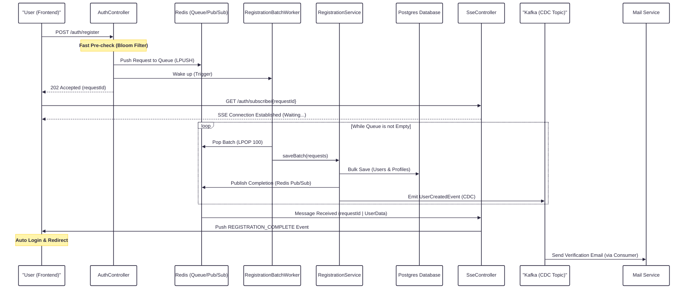

# High-Concurrency Registration Architecture (World Cup Scale)

This document outlines the high-performance registration flow implemented in OmniBooking to handle massive concurrent traffic (100k+ requests/sec).

## 1. Architectural Overview

The system transitions from a traditional synchronous registration flow to a **Buffered Batch & Event-Driven** architecture.

### Key Components:

1. **Redis Registration Queue**: Acts as a high-speed buffer to absorb sudden spikes in traffic.
2. **Registration Batch Worker**: Consumes requests in batches (e.g., 100 at a time) and performs bulk inserts into the Database.
3. **Kafka CDC (Change Data Capture) Simulation**: Emits events to Kafka after successful DB persistence, decoupling side-effects from the core registration logic.
4. **User CDC Consumer**: Listens for user creation events to handle asynchronous tasks like sending verification emails.

---

## 2. Sequence Diagram

View Diagram Source (Mermaid)

## Detailed Processing Flow (Updated)

1. **Ingestion**: `AuthController` receives the request, performs a high-speed Bloom Filter pre-check, and pushes the payload into the Redis List (`registration_queue`). It returns a **202 Accepted** status along with a unique `requestId`.
2. **Subscription**: The Frontend immediately establishes a **Server-Sent Events (SSE)** connection to `/auth/subscribe/{requestId}` to listen for real-time processing updates.
3. **Batch Processing**: The `RegistrationBatchWorker` retrieves requests from Redis in batches (Batch Size: 100) and delegates the persistence logic to `RegistrationService`.
4. **Persistence & Notification**:
   - `RegistrationService` performs a bulk save into Postgres within a single transaction.
   - Immediately after a successful commit, it publishes a completion message to **Redis Pub/Sub**.
5. **Real-time Delivery**: The `SseController` (on any available backend node) receives the message from Redis and pushes the User data directly to the client via the open SSE stream.
6. **Completion**: The Frontend receives the event, updates the authentication state, and redirects the user—providing a seamless, non-blocking registration experience.

---

## 3. Detailed Workflow

### Phase 1: Reception (The Buffer)

- **Controller** receives the registration request.
- It performs a **Bloom Filter** check to quickly reject duplicate emails without hitting the DB.
- The request is serialized and pushed into a **Redis List** (`registration_queue`).
- A **Virtual Thread** is spawned to "wake up" the Worker.
- The user receives an immediate `202 Accepted` response.

### Phase 2: Processing (The Funnel)

- The **Batch Worker** is protected by an `AtomicBoolean` funnel, ensuring only one instance processes the queue at a time.
- It pulls requests in batches of 100.
- It uses **JPA Batching** (via `saveAll`) to minimize DB roundtrips.
- **Role Caching**: Role lookups are cached in Redis/RAM to eliminate redundant `SELECT` queries.

### Phase 3: Side Effects (CDC Style)

- After saving to the DB, the Worker emits a `UserCreatedEvent` to Kafka.
- This mimics **Change Data Capture (CDC)**, where the system reacts to data changes.
- The **CDC Consumer** handles long-running tasks (Token generation, Email sending) asynchronously, ensuring the registration process remains lightning-fast.

---

## 4. Performance Benefits

| Feature             | Impact                                                         |
| :------------------ | :------------------------------------------------------------- |
| **Virtual Threads** | Allows handling 100k+ concurrent connections with minimal RAM. |
| **Redis Buffering** | Absorbs traffic spikes, preventing DB connection exhaustion.   |
| **Batch Inserts**   | Reduces DB transaction overhead and Index update frequency.    |
| **Bloom Filter**    | Prevents 99% of "Email Exists" DB lookups.                     |
| **CDC Decoupling**  | Removes side-effects from the critical write path.             |

---

## 5. Maintenance Notes

- **Redis Queue Key**: `registration_queue`
- **Kafka Topic**: `omnibooking-user-cdc`
- **Worker Fallback**: Runs every 30 seconds automatically if the trigger mechanism fails.
