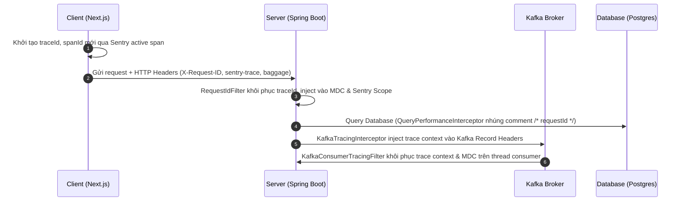

# Kiến trúc Observability & Operational Monitoring Stack - OmniBooking

Tài liệu này mô tả chi tiết toàn bộ kiến trúc giám sát vận hành (Observability), tracing phân tán, logging cấu trúc và cảnh báo lỗi của hệ thống OmniBooking.

---

## 1. Bản Đồ Dòng Chảy Tracing Phân Tán (Distributed Tracing Flow)

Hệ thống OmniBooking sử dụng chuẩn truyền dữ liệu trace (Trace Context Propagation) xuyên suốt qua các thành phần:



### Các Headers truyền Trace Context

- **`X-Request-ID`**: Request Correlation ID duy nhất.
- **`X-Correlation-ID`**: Đồng bộ với Request ID để trace chuỗi requests.
- **`sentry-trace`**: Định danh traceId và parentSpanId từ Sentry.
- **`baggage`**: Lưu metadata bổ sung của span.

---

## 2. Thiết Kế Log Cấu Trúc (Structured JSON Logging)

Để sẵn sàng cho việc phân tích log trên môi trường Kubernetes hoặc các công cụ Log Aggregator (Elasticsearch, Loki), hệ thống chia log Console làm 2 chế độ:

1. **Development / Local Profile**: Log Console dạng Plain-text màu sắc (NestJS style) tối ưu cho lập trình viên đọc.
2. **Production / Staging Profile**: Log Console được cấu trúc hóa dưới định dạng **JSON** thông qua `logstash-logback-encoder`.

### Cấu trúc một dòng Log JSON

```json
{
   "timestamp": "2026-05-29T23:00:00.123+0000",
   "level": "INFO",
   "service": "omnibooking-server",
   "environment": "production",
   "traceId": "91a0c0f682823610998f5b82142a78ff",
   "spanId": "f96f9cf5dfc37a6b",
   "requestId": "019d5cbf-35c8-7323-afc6-d92ea01201fa",
   "userId": "usr_9a2f7c10",
   "tenantId": "default",
   "module": "booking",
   "thread": "virtual-thread-23",
   "class": "com.omnibooking.services.BookingService",
   "message": "Successfully created booking: bk_019cfa12",
   "exception": ""
}
```

---

## 3. Kiến Trúc Sentry Integration & Resilience

Để tránh quá tải (Dashboard Flooding) và bảo mật dữ liệu nhạy cảm (GDPR/PDPA compliance), hệ thống áp dụng các cơ chế:

### A. Che Giấu Dữ Liệu Nhạy Cảm (PII Sanitization)

- **Utility**: `SentryPiiSanitizer` xử lý che giấu thông tin.
- **Masking**:
   - Tự động phát hiện và che giấu cấu trúc JWT tokens (`eyJ...` -> `[MASKED_JWT]`).
   - Sử dụng regex che giấu địa chỉ email và số điện thoại.
   - Tự động rà soát keys nhạy cảm trong HTTP Headers, Cookies và Response payload (`password`, `secret`, `authorization`, `cookie`, `card`, `cvv`...).

### B. Giảm Nhiễu & Chống Spam Lỗi (Noise Reduction & Grouping)

- **Ignore Exceptions Bean**: `SentryConfig` đăng ký ignore hoàn toàn các lỗi nghiệp vụ được kiểm soát để tránh ghi nhận báo động giả:
   - `AppException` (Lỗi nghiệp vụ của hệ thống).
   - `MethodArgumentNotValidException` (Lỗi validate request body 400).
   - `MissingRequestCookieException` (Lỗi thiếu session cookie 401).
   - `AccessDeniedException` (Lỗi phân quyền Spring Security 403).
- **Fingerprinting**: Lỗi được gom nhóm theo Exception Class Name + Message thay vì gom nhóm ngẫu nhiên theo stack trace, giúp lọc sạch dashboard.

### C. Cơ Chế Chống Double-Capture (Anti-Double Logging)

Sự kết hợp giữa `LoggingAspect` và `GlobalExceptionHandler` được đồng bộ hóa để chỉ đẩy lỗi hệ thống nghiêm trọng (5xx) lên Sentry **đúng một lần**:

1. Nếu lỗi xảy ra tại Controller, `LoggingAspect` ghi nhận log lỗi và capture lên Sentry, sau đó đánh dấu cờ `request.setAttribute("sentry_captured", true)`.
2. Khi lỗi trôi sang `GlobalExceptionHandler`, handler sẽ kiểm tra thuộc tính này, nếu đã có cờ thì chỉ format Response API trả về mà không capture Sentry lại.

---

## 4. Operational Monitoring Stack (Prometheus & Grafana)

Dữ liệu vận hành hạ tầng và ứng dụng (Metrics) được scrape chủ động theo mô hình Pull:

- **Actuator Endpoint**: `/api/v1/actuator/prometheus` public access cho Docker network.
- **Scrape Interval**: Prometheus kéo dữ liệu mỗi **15 giây**.
- **Hạ Tầng Tích Hợp**:
   - **Prometheus**: Lấy metrics từ Spring Boot và lưu trữ.
   - **Grafana**: Tích hợp sẵn Prometheus làm default datasource.

### A. Danh sách Metrics Vận hành Luồng Đăng ký & Bảo mật (Issue #26)

Hệ thống cung cấp các counters đo lường qua Micrometer phục vụ giám sát thời gian thực:

| Tên Metric (Prometheus Counter)          | Mô tả / Ý nghĩa                                                                           |
| :--------------------------------------- | :---------------------------------------------------------------------------------------- |
| `registration_success_total`             | Tổng số đăng ký thành công qua luồng bất đồng bộ (sau khi lưu DB thành công).             |
| `registration_failed_total`              | Tổng số đăng ký thất bại (lỗi logic trùng email, hoặc lỗi nghiêm trọng FAILED_PERMANENT). |
| `registration_sse_success_total`         | Số kết nối SSE đăng ký được hoàn thành và gửi payload thành công tới client.              |
| `registration_polling_fallback_total`    | Số lần client Next.js phải chuyển từ SSE sang cơ chế Polling dự phòng.                    |
| `registration_polling_success_total`     | Số lần Polling trạng thái đăng ký thành công (status = SUCCESS).                          |
| `registration_polling_timeout_total`     | Số lần client Polling quá thời gian chờ (hết 5 lần thử backoff và timeout).               |
| `csrf_rejected_total`                    | Tổng số request bị bộ lọc `CustomCsrfFilter` chặn lại do vi phạm CSRF.                    |
| `csrf_origin_invalid_total`              | Số lần request bị chặn do Origin/Referer không hợp lệ hoặc không thuộc `trusted-hosts`.   |
| `csrf_token_invalid_total`               | Số lần request bị chặn do Token CSRF bị sai lệch hoặc không trùng khớp với Session.       |
| `registration_status_rate_limited_total` | Số lần API kiểm tra trạng thái `/registration-status/{requestId}` bị rate limit.          |

### B. Thiết kế Dashboard Grafana đề xuất

1. **Dashboard Đăng ký (Registration Flow Dashboard)**:
   - **Tỉ lệ Thành công Đăng ký (Success Rate)**: Tính bằng tỉ lệ `registration_success_total / (registration_success_total + registration_failed_total)`.
   - **Tỉ lệ Chuyển đổi SSE vs Polling**: Biểu đồ hình tròn biểu thị phần trăm hoàn thành bằng SSE so với số lần chuyển sang Polling fallback (`registration_polling_fallback_total`).
   - **Tỉ lệ Polling Timeout**: Thống kê số lần polling thất bại do quá thời gian chờ (`registration_polling_timeout_total`).
2. **Dashboard Bảo mật (Security & CSRF Dashboard)**:
   - **Tỉ lệ Chặn CSRF (Rejection Rate)**: Biểu đồ đường vẽ tần suất `csrf_rejected_total` tăng lên.
   - **Phân loại lỗi CSRF**: Chia tỷ lệ giữa `csrf_origin_invalid_total` (lỗi Origin/Host giả mạo) và `csrf_token_invalid_total` (lỗi token sai).
   - **Sự kiện Rate Limiting**: Theo dõi biểu đồ số lần API status bị giới hạn tần suất (`registration_status_rate_limited_total`).

### C. Ngưỡng Cảnh báo Vận hành (Alerting Rules)

Các quy tắc cảnh báo (Alerts) cấu hình trong Prometheus:

- **Registration Failure Spike (Critical)**:
   - _Điều kiện_: `rate(registration_failed_total[5m]) / (rate(registration_success_total[5m]) + rate(registration_failed_total[5m])) > 0.02`
   - _Ý nghĩa_: Tỉ lệ lỗi đăng ký vượt quá **2%** trong vòng 5 phút. Kích hoạt thông báo Rollback ngay lập tức.
- **CSRF Attack Spike (Warning)**:
   - _Điều kiện_: `increase(csrf_rejected_total[5m]) > 50`
   - _Ý nghĩa_: Số lần từ chối CSRF tăng đột biến trên 50 lần trong 5 phút. Cảnh báo dấu hiệu tấn công CSRF / Host Header Injection diện rộng hoặc cấu hình sai Origin.
- **Polling Fallback Spike (Warning)**:
   - _Điều kiện_: `rate(registration_polling_fallback_total[5m]) / rate(registration_success_total[5m]) > 0.10`
   - _Ý nghĩa_: Trên **10%** người dùng phải sử dụng cơ chế Polling dự phòng thay vì SSE. Báo hiệu lỗi kết nối SSE hoặc proxy/gateway chặn EventStream.
- **Rate Limit Spike (Warning)**:
   - _Điều kiện_: `increase(registration_status_rate_limited_total[5m]) > 20`
   - _Ý nghĩa_: Có dấu hiệu client polling quá tần suất quy định hoặc bị cào dữ liệu status hàng loạt.

---

## 5. Quy trình Điều tra Lỗi & Vận hành (Troubleshooting Guide)

Khi xảy ra sự cố luồng Đăng ký hoặc Bảo mật, kỹ sư vận hành thực hiện theo quy trình sau:

### Bước 1: Thu thập Correlation ID (RequestId)

- Lấy `requestId` từ thông tin lỗi phía client (hiển thị trên giao diện hoặc trong console log dạng UUID).

### Bước 2: Truy vấn Log JSON có cấu trúc

- Sử dụng các công cụ Log Aggregator (Grafana Loki, Kibana) truy vấn bằng khoá `requestId`:
  `{service="omnibooking-server"} |= "019d5cbf-35c8-7323-afc6-d92ea01201fa"`
- Các sự kiện log theo chuỗi thời gian sẽ xuất hiện:
   1. `{"event":"registration_received"}` (Controller nhận request).
   2. `{"event":"registration_queued_inbox"}` (Đã lưu inbox PG và chuẩn bị gửi Kafka).
   3. `{"event":"registration_queued"}` (Gửi Kafka thành công).
   4. `{"event":"registration_consumed"}` (Kafka Consumer bắt đầu xử lý).
   5. `{"event":"registration_db_committed"}` (Ghi DB thành công, gửi Pub/Sub).
   6. `{"event":"registration_pubsub_received"}` (Lắng nghe Pub/Sub, chuyển SSE).
   7. `{"event":"registration_sse_sent"}` (Gửi gói tin hoàn tất qua SSE về Client).
   8. Nếu có Polling: `{"event":"registration_status_checked"}` (Client gọi API status kiểm tra dự phòng).

### Bước 3: Khoanh vùng lỗi trong 1 phút

- **Nếu thiếu bước 3 (registration_queued)**: Kiểm tra Kafka Broker, hàng đợi Kafka, hoặc cơ chế mã hóa mật khẩu AES.
- **Nếu thiếu bước 5 (registration_db_committed)**: Kiểm tra log lỗi DB (ví dụ: trùng khóa email, deadlock, đầy Pool Hikari).
- **Nếu thiếu bước 7 (registration_sse_sent)**: Lỗi mạng client, hoặc proxy nginx/gateway chặn kết nối SSE.

---

## 6. Giám Sát Cơ Sở Dữ Liệu & Kafka

### A. Hibernate Slow Query & N+1 Warning

- **Statement Commenting**: `QueryPerformanceInterceptor` (StatementInspector) tự động chèn `/* requestId: <id> */` vào đầu mọi câu truy vấn SQL trước khi gửi sang PostgreSQL. Giúp quản trị viên DB dễ dàng tìm lại dòng code sinh ra câu SQL bị chậm từ file log DB.
- **N+1 Warning Detector**: Tự động đếm số câu truy vấn DB được gọi trên cùng một HTTP request thread. Nếu số lượng query vượt quá giới hạn **30 queries**, hệ thống lập tức xuất log cảnh báo `[N+1 Warning]` kèm log chi tiết câu SQL cuối cùng.

### B. Sentry Cron Monitoring

- Tích hợp Sentry check-in cho `OutboxWorker` (slug: `outbox-worker`) và `CurrencyWorker` (slug: `currency-worker`).
- Mỗi khi job chạy, hệ thống bắn tín hiệu `IN_PROGRESS` lên Sentry Crons. Khi kết thúc thành công bắn tín hiệu `OK`, nếu lỗi bắn tín hiệu `ERROR`. Cho phép phát hiện tức thời nếu worker bị treo hoặc chết luồng.

### C. Booking Lifecycle & Reconciliation Monitoring

Hệ thống OmniBooking tích hợp giám sát nâng cao cho vòng đời đặt phòng và các tác vụ đối soát.

#### 1. Các Metrics mới (Prometheus Counters)

Hệ thống tự động ghi nhận các chỉ số vận hành sau:

| Tên Metric (Prometheus Counter)                     | Mô tả / Ý nghĩa                                                              |
| :-------------------------------------------------- | :--------------------------------------------------------------------------- |
| `omnibooking.booking.created.total`                 | Tổng số booking được tạo.                                                    |
| `omnibooking.booking.confirmed.total`               | Tổng số booking được xác nhận thành công.                                    |
| `omnibooking.booking.expired.total`                 | Tổng số booking bị hủy tự động do hết hạn thanh toán.                        |
| `omnibooking.payment.callback.duplicate.total`      | Số lần nhận callback thanh toán Momo/Visa bị trùng lặp.                      |
| `omnibooking.booking.expiration.failure.total`      | Số lỗi xảy ra trong quá trình xử lý hết hạn booking.                         |
| `omnibooking.booking.idempotency.hit.total`         | Số lần trúng cache Idempotency ngăn chặn trùng lặp tạo booking.              |
| `omnibooking.reconciliation.anomaly.total`          | Tổng số bất thường đối soát được phát hiện bởi Reconciliation Worker.        |
| `omnibooking.reconciliation.inventory_leak.total`   | Số vụ rò rỉ inventory (booking hết hạn/hủy vẫn giữ phòng).                   |
| `omnibooking.reconciliation.payment_mismatch.total` | Số vụ bất nhất thanh toán (đã thanh toán nhưng booking không được xác nhận). |
| `omnibooking.reconciliation.stuck_booking.total`    | Số lượng booking bị kẹt ở trạng thái chờ thanh toán quá hạn.                 |

#### 2. Quy tắc cảnh báo Prometheus (Booking Alerting Rules)

Các luật cảnh báo quan trọng cấu hình trong Prometheus:

```yaml
- alert: BookingExpirationFailureSpike
  expr: increase(omnibooking_booking_expiration_failure_total[5m]) > 5
  for: 2m
  labels: { severity: critical }
  annotations: { summary: "Booking expiration failures spiking" }

- alert: DuplicatePaymentSpike
  expr: increase(omnibooking_payment_callback_duplicate_total[5m]) > 10
  for: 2m
  labels: { severity: warning }

- alert: ReconciliationAnomalies
  expr: increase(omnibooking_reconciliation_anomaly_total[1h]) > 0
  for: 5m
  labels: { severity: critical }
  annotations: { summary: "Booking reconciliation found discrepancies" }

- alert: InventoryLeakDetected
  expr: increase(omnibooking_reconciliation_inventory_leak_total[1h]) > 0
  for: 5m
  labels: { severity: critical }
  annotations:
     { summary: "Inventory leak detected — EXPIRED/CANCELLED bookings still holding inventory" }

- alert: PaymentMismatchDetected
  expr: increase(omnibooking_reconciliation_payment_mismatch_total[1h]) > 0
  for: 5m
  labels: { severity: critical }
  annotations: { summary: "Paid booking not confirmed — possible payment-to-booking inconsistency" }

- alert: StuckBookingsDetected
  expr: increase(omnibooking_reconciliation_stuck_booking_total[1h]) > 0
  for: 5m
  labels: { severity: warning }
  annotations:
     {
        summary: "Bookings stuck in PENDING_PAYMENT past expiry — expiration worker may have failed",
     }
```

#### 3. Dashboard Grafana đề xuất - "Booking Operations"

| Panel                        | Metric                                                   | Type          |
| :--------------------------- | :------------------------------------------------------- | :------------ |
| Booking Creation Rate        | `rate(omnibooking_booking_created_total[5m])`            | Graph         |
| Confirmation Rate            | `rate(omnibooking_booking_confirmed_total[5m])`          | Graph         |
| Expiration Rate              | `rate(omnibooking_booking_expired_total[5m])`            | Graph         |
| Expiration vs Confirmation   | expired / confirmed ratio                                | Stat          |
| Inventory Reserve vs Release | `reservation_total` vs `release_total`                   | Graph         |
| Payment Duplicate Rate       | `rate(omnibooking_payment_callback_duplicate_total[5m])` | Graph         |
| Expiration Failures          | `expiration_failure_total`                               | Stat (Red)    |
| Reconciliation Anomalies     | `reconciliation_anomaly_total`                           | Stat (Red)    |
| Inventory Leaks              | `reconciliation_inventory_leak_total`                    | Stat (Red)    |
| Payment Mismatches           | `reconciliation_payment_mismatch_total`                  | Stat (Red)    |
| Stuck Bookings               | `reconciliation_stuck_booking_total`                     | Stat (Yellow) |
