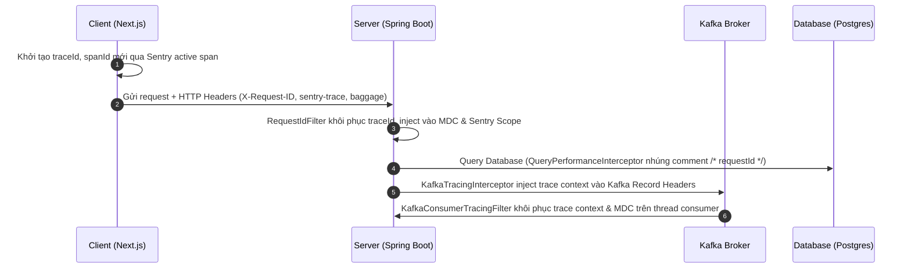

# Kiến trúc Observability & Operational Monitoring Stack - OmniBooking

Tài liệu này mô tả chi tiết toàn bộ kiến trúc giám sát vận hành (Observability), tracing phân tán, logging cấu trúc và cảnh báo lỗi của hệ thống OmniBooking.

---

## 1. Bản Đồ Dòng Chảy Tracing Phân Tán (Distributed Tracing Flow)

Hệ thống OmniBooking sử dụng chuẩn truyền dữ liệu trace (Trace Context Propagation) xuyên suốt qua các thành phần:



### Các Headers truyền Trace Context

- **`X-Request-ID`**: Request Correlation ID duy nhất.
- **`X-Correlation-ID`**: Đồng bộ với Request ID để trace chuỗi requests.
- **`sentry-trace`**: Định danh traceId và parentSpanId từ Sentry.
- **`baggage`**: Lưu metadata bổ sung của span.

---

## 2. Thiết Kế Log Cấu Trúc (Structured JSON Logging)

Để sẵn sàng cho việc phân tích log trên môi trường Kubernetes hoặc các công cụ Log Aggregator (Elasticsearch, Loki), hệ thống chia log Console làm 2 chế độ:

1. **Development / Local Profile**: Log Console dạng Plain-text màu sắc (NestJS style) tối ưu cho lập trình viên đọc.
2. **Production / Staging Profile**: Log Console được cấu trúc hóa dưới định dạng **JSON** thông qua `logstash-logback-encoder`.

### Cấu trúc một dòng Log JSON

```json
{
   "timestamp": "2026-05-29T23:00:00.123+0000",
   "level": "INFO",
   "service": "omnibooking-server",
   "environment": "production",
   "traceId": "91a0c0f682823610998f5b82142a78ff",
   "spanId": "f96f9cf5dfc37a6b",
   "requestId": "019d5cbf-35c8-7323-afc6-d92ea01201fa",
   "userId": "usr_9a2f7c10",
   "tenantId": "default",
   "module": "booking",
   "thread": "virtual-thread-23",
   "class": "com.omnibooking.services.BookingService",
   "message": "Successfully created booking: bk_019cfa12",
   "exception": ""
}
```

---

## 3. Kiến Trúc Sentry Integration & Resilience

Để tránh quá tải (Dashboard Flooding) và bảo mật dữ liệu nhạy cảm (GDPR/PDPA compliance), hệ thống áp dụng các cơ chế:

### A. Che Giấu Dữ Liệu Nhạy Cảm (PII Sanitization)

- **Utility**: `SentryPiiSanitizer` xử lý che giấu thông tin.
- **Masking**:
   - Tự động phát hiện và che giấu cấu trúc JWT tokens (`eyJ...` -> `[MASKED_JWT]`).
   - Sử dụng regex che giấu địa chỉ email và số điện thoại.
   - Tự động rà soát keys nhạy cảm trong HTTP Headers, Cookies và Response payload (`password`, `secret`, `authorization`, `cookie`, `card`, `cvv`...).

### B. Giảm Nhiễu & Chống Spam Lỗi (Noise Reduction & Grouping)

- **Ignore Exceptions Bean**: `SentryConfig` đăng ký ignore hoàn toàn các lỗi nghiệp vụ được kiểm soát để tránh ghi nhận báo động giả:
   - `AppException` (Lỗi nghiệp vụ của hệ thống).
   - `MethodArgumentNotValidException` (Lỗi validate request body 400).
   - `MissingRequestCookieException` (Lỗi thiếu session cookie 401).
   - `AccessDeniedException` (Lỗi phân quyền Spring Security 403).
- **Fingerprinting**: Lỗi được gom nhóm theo Exception Class Name + Message thay vì gom nhóm ngẫu nhiên theo stack trace, giúp lọc sạch dashboard.

### C. Cơ Chế Chống Double-Capture (Anti-Double Logging)

Sự kết hợp giữa `LoggingAspect` và `GlobalExceptionHandler` được đồng bộ hóa để chỉ đẩy lỗi hệ thống nghiêm trọng (5xx) lên Sentry **đúng một lần**:

1. Nếu lỗi xảy ra tại Controller, `LoggingAspect` ghi nhận log lỗi và capture lên Sentry, sau đó đánh dấu cờ `request.setAttribute("sentry_captured", true)`.
2. Khi lỗi trôi sang `GlobalExceptionHandler`, handler sẽ kiểm tra thuộc tính này, nếu đã có cờ thì chỉ format Response API trả về mà không capture Sentry lại.

---

## 4. Operational Monitoring Stack (Prometheus & Grafana)

Dữ liệu vận hành hạ tầng (Metrics) được scrape chủ động theo mô hình Pull:

- **Actuator Endpoint**: `/api/v1/actuator/prometheus` public access cho Docker network.
- **Scrape Interval**: Prometheus kéo dữ liệu mỗi **15 giây**.
- **Hạ Tầng Tích Hợp**:
   - **Prometheus**: Lấy metrics từ Spring Boot và lưu trữ.
   - **Grafana**: Tích hợp sẵn Prometheus làm default datasource, sẵn sàng cung cấp các dashboards:
      - `jvm-metrics.json`: Giám sát bộ nhớ Heap, non-Heap, trạng thái Garbage Collection, CPU, Thread pool.
      - `api-metrics.json`: Giám sát Request rate (RPS), Error rate, Latency percentiles.
      - `hikari-metrics.json`: Theo dõi kết nối rảnh/bận trong Hikari Connection Pool.
      - `kafka-metrics.json`: Theo dõi consumer lag, throughput và kích thước hàng đợi DLQ.

---

## 5. Giám Sát Cơ Sở Dữ Liệu & Kafka

### A. Hibernate Slow Query & N+1 Warning

- **Statement Commenting**: `QueryPerformanceInterceptor` (StatementInspector) tự động chèn `/* requestId: <id> */` vào đầu mọi câu truy vấn SQL trước khi gửi sang PostgreSQL. Giúp quản trị viên DB dễ dàng tìm lại dòng code sinh ra câu SQL bị chậm từ file log DB.
- **N+1 Warning Detector**: Tự động đếm số câu truy vấn DB được gọi trên cùng một HTTP request thread. Nếu số lượng query vượt quá giới hạn **30 queries**, hệ thống lập tức xuất log cảnh báo `[N+1 Warning]` kèm log chi tiết câu SQL cuối cùng.

### B. Sentry Cron Monitoring

- Tích hợp Sentry check-in cho `OutboxWorker` (slug: `outbox-worker`) và `CurrencyWorker` (slug: `currency-worker`).
- Mỗi khi job chạy, hệ thống bắn tín hiệu `IN_PROGRESS` lên Sentry Crons. Khi kết thúc thành công bắn tín hiệu `OK`, nếu lỗi bắn tín hiệu `ERROR`. Cho phép phát hiện tức thời nếu worker bị treo hoặc chết luồng.
