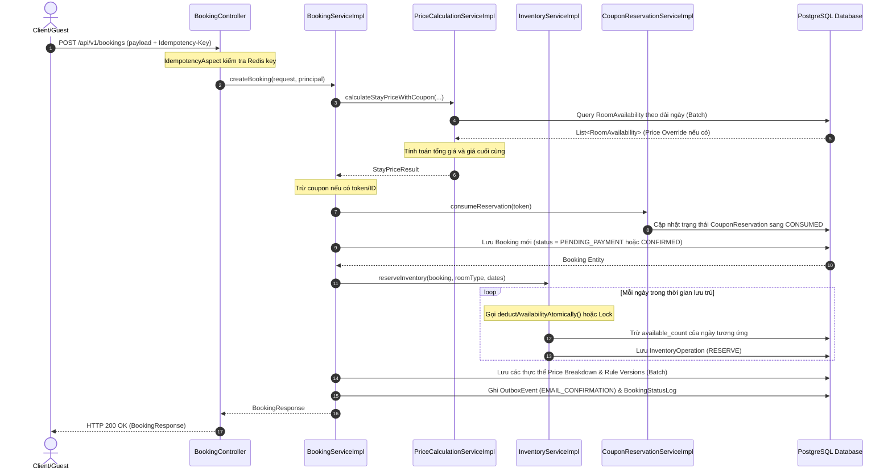
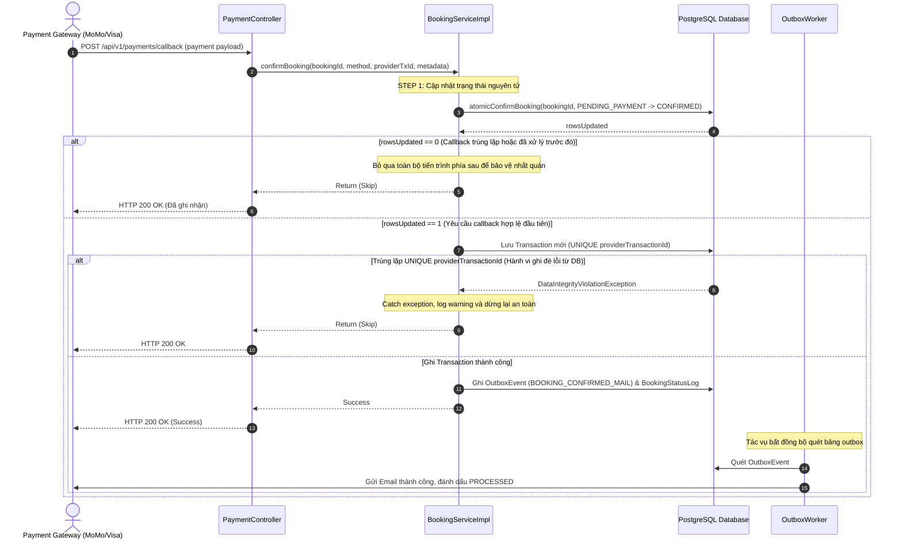
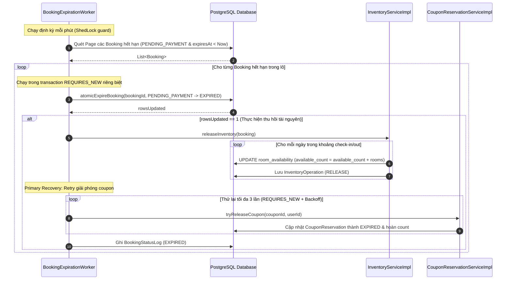
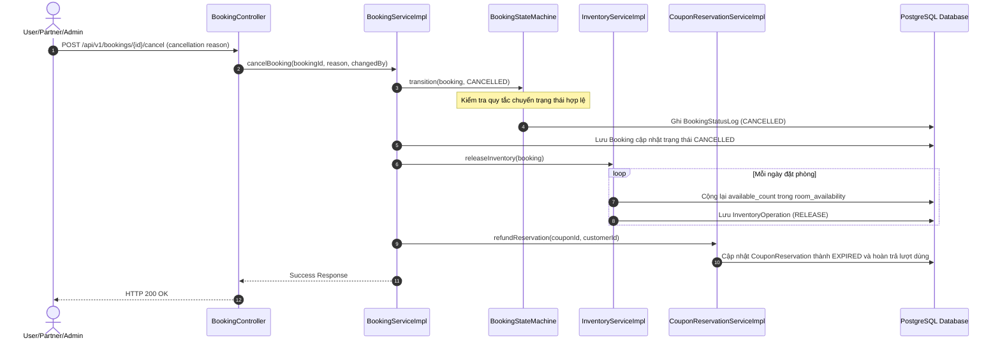
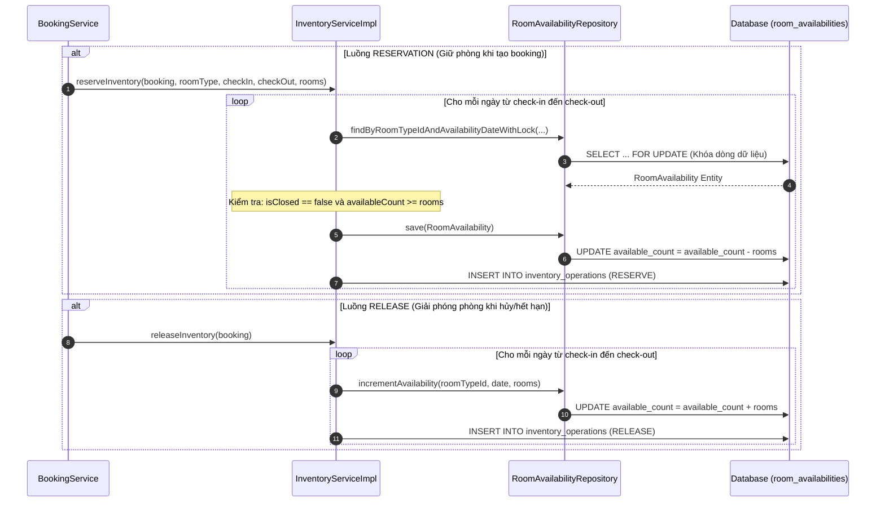

# Các Sơ Đồ Tuần Tự Hệ Thống (System Sequence Diagrams)

Tài liệu này chứa các sơ đồ tuần tự biểu diễn bằng Mermaid để trực quan hóa luồng đi của dữ liệu, phân tách trách nhiệm giữa các component và các ràng buộc nghiệp vụ trong luồng đặt phòng.

---

## 1. Sơ đồ luồng Tạo Đặt phòng (Booking Creation Flow)

Mô tả luồng từ khi Client gửi yêu cầu tạo đặt phòng cho đến khi lưu outbox sự kiện gửi email xác nhận.

---

## 2. Sơ đồ luồng Xác nhận Thanh toán (Payment Confirmation Webhook Flow)

Mô tả cách thức hệ thống xử lý callback webhook từ Momo/Visa, ngăn chặn callback trùng lặp và bảo vệ tính nhất quán giao dịch.

---

## 3. Sơ đồ luồng Hết hạn đặt phòng (Reservation Expiration Flow)

Mô tả luồng quét tự động của `BookingExpirationWorker` để hủy đặt phòng chưa thanh toán và giải phóng tài nguyên.

---

## 4. Sơ đồ luồng Hủy Đặt phòng (Booking Cancellation Flow)

Mô tả luồng khách hàng chủ động hủy đặt phòng đang hoạt động và quy trình giải phóng tự động.

---

## 5. Sơ đồ luồng Giữ phòng và Giải phóng Kho phòng (Inventory Reservation and Release Flow)

Trực quan hóa chi tiết các thao tác ghi nhật ký ledger và cập nhật số lượng phòng khả dụng.

